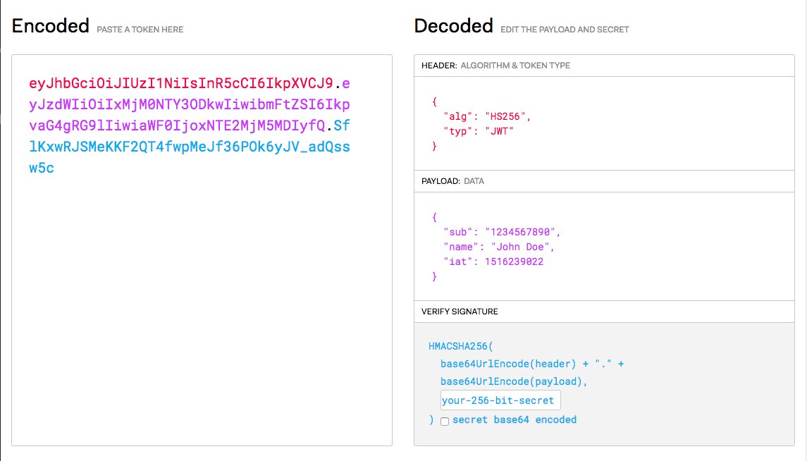

# 使用者認證

## Token 認證方式

以往 web 一般使用 session 搭配 cookie 和瀏覽器的機制來做身份驗證， 但當伺服器有做負載平衡時，session 可能在不同伺服器上，而驗證失敗。

而在手機上由於和瀏覽器的機制不同，想要使用 session 機制驗證會需要額外的整合實作 ([https://build.affinity.co/persisting-sessions-with-react-native-4c46af3bfd83](https://build.affinity.co/persisting-sessions-with-react-native-4c46af3bfd83))，因此在 React Native 一般搭配 Token 方式進行驗證。

 Token 機制是一種無狀態的認證方式，與伺服器沒有耦合，即使伺服器在負載平衡架構下可以進行驗證，也能支援跨網域請求。

### 後端

使用者登入成功時，由伺服器簽章產生一個 token，內容包含使用者身份識別、簽章時間、並且將這個 token 傳回給前端

### 前端

前端收到 token 後，便可以使用這個 token 作為個人身份的驗證依據，將 token 附帶在需要驗證的 request 中，後端就可以對 request 中的 token 進行驗證

## JWT

JWT (JSON Web Token) 是一種以 JSON 格式為基礎的 Token 標準

### 特性

- 無加密 (但可自行加密)
- 可提供  常態資料
- 簽章後無法在使用過程中撤銷

### 內容

一個 JWT token 的內容分成三個部分

- Header (JWT 格式描述)
- Payload (使用者身份資料)
- Signature (簽章)

分別經過 Base64Url 重新編碼後，用 `.` 隔開，將三個部分組合成一個字串

`$Header_Base64Url_String.$Payload_Base64Url_String.$Signature_Base64UrlSting`



### Header

描述 JWT 標準的 JSON 物件

```JSON
{
  "alg": "HS256",
  "typ": "JWT"
}
```

### Payload

使用者識別或其他資料的 JSON 物件

JWT 官方標準 (選用)

JWT Registered Claim Names: [https://tools.ietf.org/html/rfc7519#section-4.1](https://tools.ietf.org/html/rfc7519#section-4.1)

- iss (issuer) : 簽發者
- exp (expiration time) : 有效期限 Unix timestamp
- sub (subject) : 主題
- aud (audience) : 接受者
- nbf (Not Before) : 生效時間
- iat (Issued At) : 簽發時間
- jti (JWT ID) : JWT 編號

```JSON
{
  "userId": 1,
  "name": "DMoon",
  "admin": true
}
```

### Signature

Signature 是由後端伺服器使用一組密鑰 (secret) 與 Header、Payload 透過 Header 中指定的簽章演算法產生的簽章。

簽章演算法公式：

```javascript
HMACSHA256(base64UrlEncode(header) + '.' + base64UrlEncode(payload), secret);
```

## 使用方式

前端要處理的事情：
登入取得 token 後，將 token 進行保存，如果想要 App 不需要在每次重新開啟都重新登入，可以把 token 記錄到 AsyncStorage 中

附帶在需驗證 API 的  request header

```text
Authorization: Bearer <token>
```
