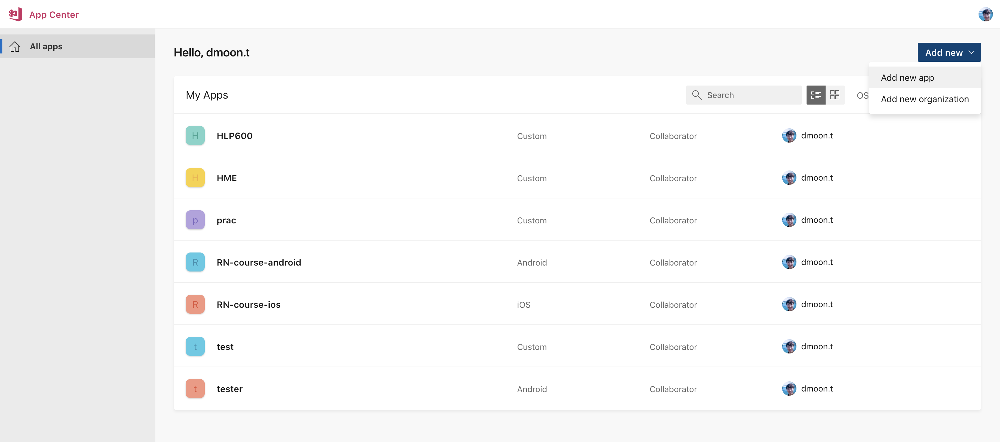
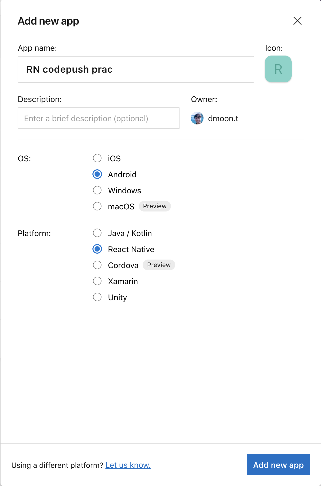
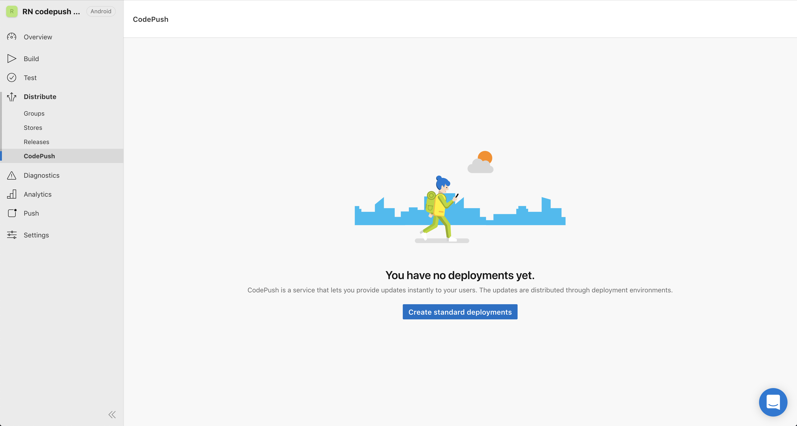

# CodePush 熱部署

管理後台 (App Center): https://www.appcenter.ms/

GitHub Repository: [https://github.com/Microsoft/react-native-code-push](https://github.com/Microsoft/react-native-code-push)

CodePush 是微軟提供的一個熱部署服務，可以在微軟的伺服器上發佈新的程式碼版本，讓 App 與伺服器互動得知是否有新版本，進而下載安裝。

> CodePush 只能更新 JavaScript，無法更新原生程式碼

## 註冊

到 https://www.appcenter.ms/　註冊帳號 (可以使用 GitHub 帳號登入)

登入後會進入App 管理頁面：https://appcenter.ms/apps

點右上角的 Add new 按鈕新增 App



填寫 App 資訊 

- 填寫 App 名稱 (iOS 和 Android 要分開建立，可以加上 ios / android 以便識別)
- 選擇手機 OS
- 平台選擇 React Native

按 Add new app 完成註冊



完成後會進入 App 管理頁面

左邊選到`Distribute/CodePush` 按下 `Create standard deployments`按鈕




## 套件整合

### 安裝

#### appcenter-cli

```bash
npm i -g appcenter-cli
appcenter login
# 會印出一段網址，用瀏覽器連到網址進行登入後，網頁會顯示授權 token，將 token 複製貼到 terminal 中完成登入
```

#### react-native-code-push

```bash
npm install --save react-native-code-push
react-native link react-native-code-push
```

執行 link 指令時，會詢問 ios 及 android 的 codepush development key
若是不知道可以透過 `appcenter-cli` 的指令查詢，或是先按 enter 跳過

```bash
appcenter codepush deployment list --app <appcenter-username>/<appcenter-app-name> -k
```

跳過的話需要手動到原生專案中設定 key

#### iOS

`info.plist` 中找到 `CodePushDeploymentKey`
將 deployment key 填入

```xml
<key>CodePushDeploymentKey</key>
<string>__DEPLOYMENT_KEY__</string>
```

#### Android

編輯 `/android/app/res/values/strings.xml`
加入 `reactNativeCodePush_androidDeploymentKey` 和 deployment key

```xml
<resources>
  <string moduleConfig="true" name="reactNativeCodePush_androidDeploymentKey">__DEPLOYMENT_KEY__</string>
</resources>
```

### 使用

以 HOC 方式包裝專案的 Root Component

```js
const CodePushApp = codePush({
  // options
  updateDialog: false
})(AppRootComponent);
```

另一種方式為透過 ES7 decorator 語法包裝專案的 Root Component
目前尚未直接支援 ES7 decorator 語法，此種方法需要透過 babel 套件設定 `babel-preset-react-native-stage-0`，透過 babel 處理才可使用
如下：

```js
import codePush from 'react-native-code-push';

@codePush({
  // options
  updateDialog: false
})
class MyApp extends Component {}
```

預設情況下，App 會在每次啟動時到 CodePush center 查詢有沒有新的 JS 程式碼版本
如果有會  先進行下載，並在下次重啟 App 時安裝

### 發佈新版本更新

透過 appcenter-cli 操作

```bash
appcenter codepush release-react -a <appcenter_username>/<appcenter-appname> -d Staging
```

#### -d deployment 參數

預設有 `Staging`、`Production` 兩種 deployment
分別有不同的 deployment key
可以想像成不同的程式碼版本管理 branch
可將 Staging 用在 Beta  版本的 App，而 Production 用在上架的 App 上

```bash
appcenter codepush release-react -a <appcenter_username>/<appcenter-appname> -d Staging
```

#### -t 版本參數

```bash
appcenter codepush release-react -a <appcenter_username>/<appcenter-appname> -t <targetBinaryVersion>
```

## 測試方法

先跟著 [打包 JS](/release/index.md) 和 [ 編譯專案產生 App 安裝檔](/release/generate-app.md) 打包 apk

將 release apk 安裝到手機或模擬器後
便可以試著修改 App 內容，再透過 code-push-cli 發佈新版本

```bash
appcenter codepush release-react -a <ownerName>/<appName> -d <deploymentName> -t <targetBinaryVersion>
```

重新開啟 App 時，App 會檢查是否有新版本，若有則會下載，並在下次 App 時啟動安裝生效 
再次重啟 App 便可看到新的修改內容
