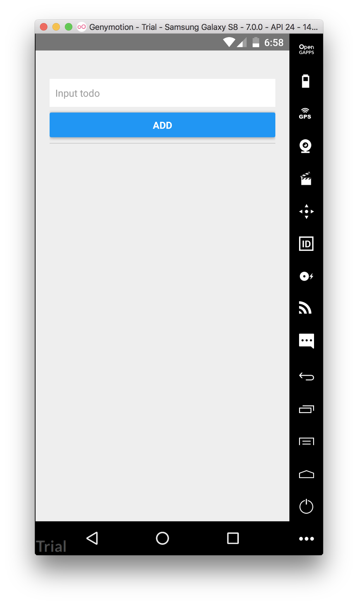

# ToDoList 練習串接 RESTful API

難度： 基礎

目標： 在 React Native 透過 fetch 使用呼叫後端 API

專案： 

* app: https://github.com/agileworks-tw/RN_Todo_Sample 分支 `practice/005002_answer`
* server: https://github.com/agileworks-tw/express-example 分支 `practice/005002_answer`

練習： 

新增、刪除與取得 ToDo 列表功能，後端在上述專案連結皆已實作完成，步驟如下

1.  串接取得 ToDo 列表，綁定到 FlatList 資料來源
2.  串接 create API，當發送成功時，將新的 ToDo 加入到 state 物件中
3.  串接 delete API，當發送成功時，將欲刪除的 ToDo 從 state 物件中移除

使用 `參考資料` 所提供的 API，完成此練習步驟，讓 App 可以透過 fetch 與後端互動

## 練習前設置

### 下載專案

- ToDoList RESTful API server

```bash
cd ~/workspace
git clone https://github.com/agileworks-tw/express-example
cd express-example
git checkout practice/005002_answer
yarn
```

- ToDoList React Native Sample

```bash
cd ~/workspace
git clone https://github.com/kyoyadmoon/RN_Todo_Sample
cd RN_Todo_Sample
yarn
```

### 執行專案 （依照順序執行)

Run API server

```bash
cd ~/workspace/express-example
npm start
```

Run React Native ToDoList

```bash
cd ~/workspace/RN_Todo_Sample
# 確認在 feature/add-todo-list branch

# 這會執行 packager server
react-native start

# 需要另外開一個 terminal
react-native run-android

# 模擬器連接 3000 port
adb reverse tcp:3000 tcp:3000
```

完成後應該可以在 android 看到成功畫面



## 參考資料

### API 規格

- get `/api/users/ReactNative/tasks`

```text
method: 'get'
```

- create `/api/users/ReactNative/tasks/create`

```text
method 'post'
```

- delete `/api/task/${id}`

```text
method: 'delete'
```

### 練習解答

下面連結，提供完成練習需要調整的程式內容

解答連結　[https://github.com/agileworks-tw/RN_Todo_Sample/pull/1](https://github.com/agileworks-tw/RN_Todo_Sample/pull/1)
