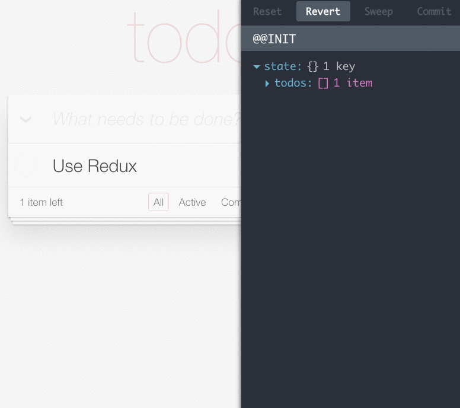

# Redux 介紹

`Redux 是 JavaScript 應用程式的狀態管理容器`，可以理解成應用程式的資料狀態中心，提供可預測化的狀態管理 ，在 React 專案中可以處理 Component 之間的通訊。

## Redux 核心概念

UI 是狀態資料的延伸，為了保持 Single Source of Truth，Redux 將需要共享的資料狀態保存在一個 Object 中統一管理，這個狀態中心稱為 Store，將這個 Store 作為  狀態的資料庫使用，`管理所有需要共享的資料狀態`，需要相關資料的 Component 可以透過接口向 store 綁定唯一的資料來源。

## Time Travelling Debugger

> Redux 是可預測的狀態管理容器，透過 Action 紀錄每個操作，可以搭配開發工具  實作出時光機的除錯功能，瀏覽狀態資料的完整變化紀錄，甚至可以取消某個 Action

