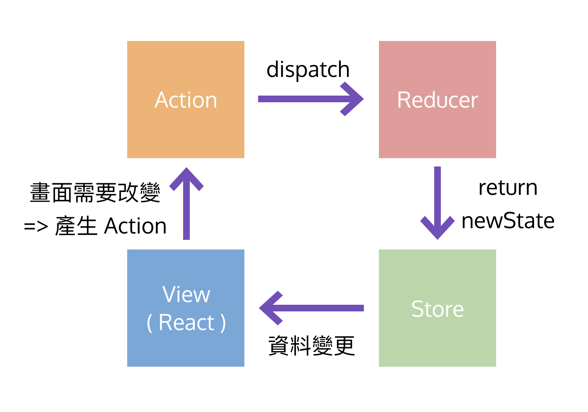

# Redux 的組成與資料流



## Store

> 存放共用 state 的容器

- object tree
- Immutable

```js
{
  todos: [
    {
      text: 'todo1',
      completed: true,
    },
  ],
}
```

## Action

> 事件的描述

- JS object
- 包含事件的描述與更新 state 所需的相關資料
- type 是必要的，表示要執行的動作

```js
const ADD_TODO = 'ADD_TODO';

// action
{
  type: ADD_TODO,  // required
  text: 'Build my first Redux app',
}
```

## ActionCreator

> 產生 Action 的 pure function

- pure function，返回一個 action
- dispatch 到 reducer

```js
const ADD_TODO = 'ADD_TODO';

// action creator
function requestAddTodo() {
  return {
    type: ADD_TODO,
    text: 'Build my first Redux app'
  };
}

// 派發 Action
dispatch(requestAddTodo());
```

## Reducer

> 更新 State

- pure function
- return new state

`Reducer`

```js
function todos(state = [], action) {
  switch (action.type) {
    case ADD_TODO:
      return [
        ...state,
        {
          text: action.text,
          completed: false
        }
      ];
    default:
      return state;
  }
}
```

`Store`

```js
store = {
  todos: [
    {
      text: 'todo1 title',
      completed: false
    },
    {
      text: 'todo2 title',
      completed: true
    }
  ]
};
```