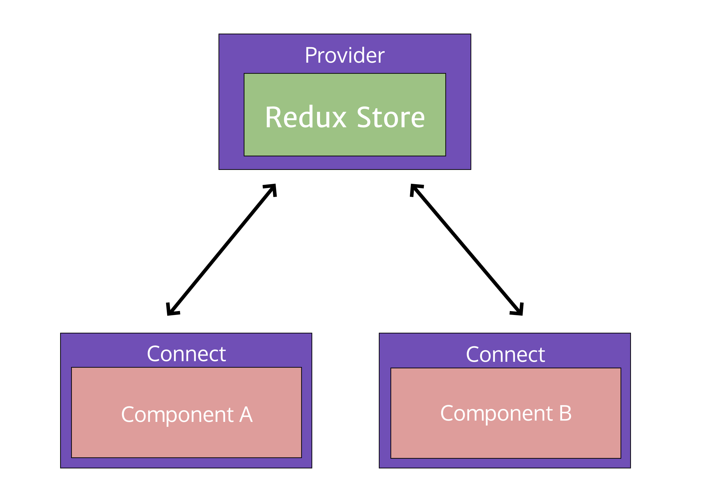

## React Redux 運作方式

將 react-redux 的 Provider Component 作為 React 專案的 Root Component，這樣 Provider 就會是所有 children component 的共同父元件，之後透過 Connect 方法將 Component 與 Redux 連接，Provider 便可以透過 prop 將 component 需要的資料一路往下傳遞到透過 connect 方法連接 Redux 的 component



## Smart Component / Dumb Component

|                    | 容器組件 (Smart Component) | 展示組件 (Dumb Component) |
| ------------------ | -------------------------- | ------------------------- |
| **位置**           | 最頂層，路由處理           | 中間和子組件              |
| **連結 Redux**　　 | 是                         | 否                        |
| **讀取數據**       | 從 Redux 獲取 state        | 從 props 獲取數據         |
| **修改數據**       | 向 Redux 派發 actions      | 從 props 調用回調函數     |

## 整合

### 配置 Store 

`configureStore.js`

```js
import { Platform } from 'react-native';
import { createStore, applyMiddleware, compose } from 'redux';
import reducer from './reducers';
let composeEnhancers = compose;

if (__DEV__) {
  composeEnhancers = (
    window.__REDUX_DEVTOOLS_EXTENSION_COMPOSE__
    || require('remote-redux-devtools').composeWithDevTools
  )({
    name: Platform.OS,
    ...require('../package.json').remotedev,
    // actionCreators,
  });
}
    
const enhancer = composeEnhancers(applyMiddleware());
 export default function configureStore(initialState) {
  const store = createStore(reducer, initialState, enhancer);
  if (module.hot) {
    module.hot.accept(() => {
      store.replaceReducer(require('./reducers').default);
    });
  }
  return store;
}
```


### Reducers

`/reducers/index.js`

```js
import { combineReducers } from 'redux';
export default combineReducers({
  
});
```


### 進入點

```js
import React from 'react';
import { AppRegistry } from 'react-native';
import { Provider } from 'react-redux';
import configureStore from './configureStore';
import App from './App';
import { name as appName } from '../app.json';

export const store = configureStore();
 const App = () => (
  <Provider store={store}>
    <TodoList />
  </Provider>
);

AppRegistry.registerComponent(appName, () => App);
```


## Usage

### Action

`/actions/todoList.js`

```js
export const ADD_TODO = 'ADD_TODO';
export function addToDo(data) {
  return {
    type: ADD_TODO,
    data
  }
} 
```


### Reducer

`/reducers/index.js`

```js
import { combineReducers } from 'redux';
import todoList from './todoList.js';
export default combineReducers({
  todoList
});
```

`/reducers/todoList.js`

```js
import { RECEIVE_TODO_LIST, DELETE_TODO, ADD_TODO } from '../actions/todoList';
 const defaultState = [];
 export default todoList = (state = defaultState, action) => {
  switch (action.type) {
    case ADD_TODO: {
      return [
        ...state,
        action.data
      ];
    }
    default:
      return state;
  }
};
```


### Component 連結 Redux

```js
import { bindActionCreators } from 'redux';
import { connect } from 'react-redux';
import {
  addToDo,
} from '../actions/todoList';

class MyComponent extends Component {
    ...
    componentDidMount() {
       this.props.addToDo(todoData); 
    }
　　...
}

export default connect(
  state => ({
    todoList: state.todoList
  }),
  dispatch => bindActionCreators({
    addToDo
  }, dispatch)
)(MyComponent) 
```


