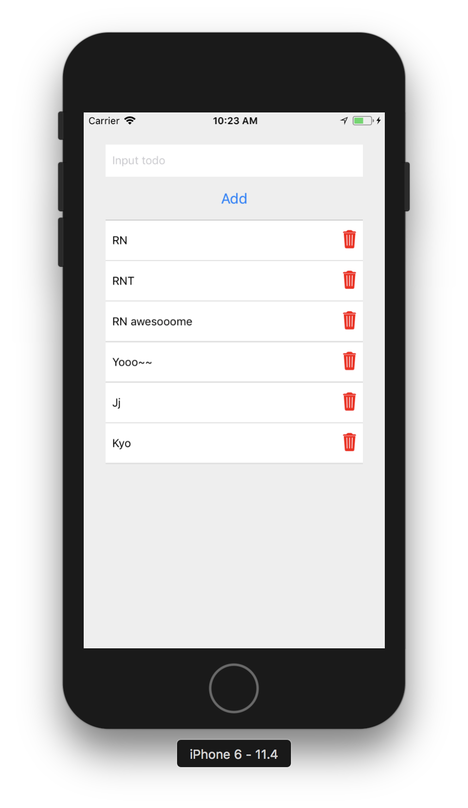

# 整合套件練習

## 下載專案

- ToDoList React Native Sample

```bash
cd ~/workspace
git clone https://github.com/agileworks-tw/RN_Todo_Sample
cd RN_Todo_Sample
yarn
```

## 練習目標

> 切換到 `feature/todo-list-with-api-server` branch

1.  整合 icon 套件 react-native-vector-icons [https://github.com/oblador/react-native-vector-icons](https://github.com/oblador/react-native-vector-icons)

2.  將刪除按鈕的刪除字樣改以刪除 Icon 表示
    參考  Icon : Ionicons / trash

##  預計完成畫面



## 參考範例

範例連結： [https://github.com/agileworks-tw/RN_Todo_Sample/pull/2](https://github.com/agileworks-tw/RN_Todo_Sample/pull/2)
