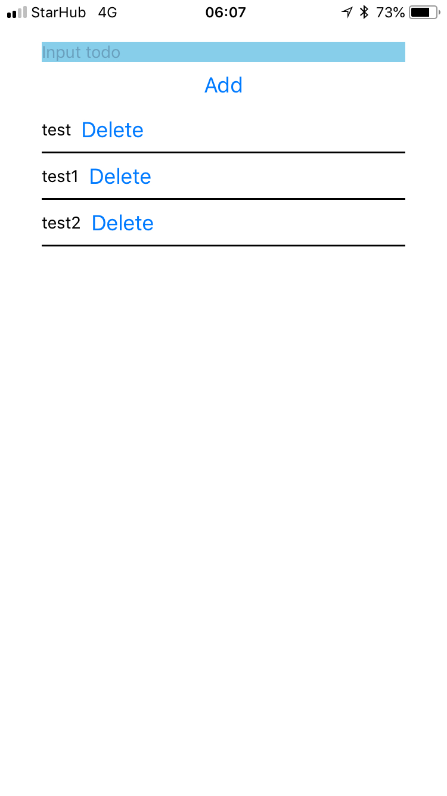
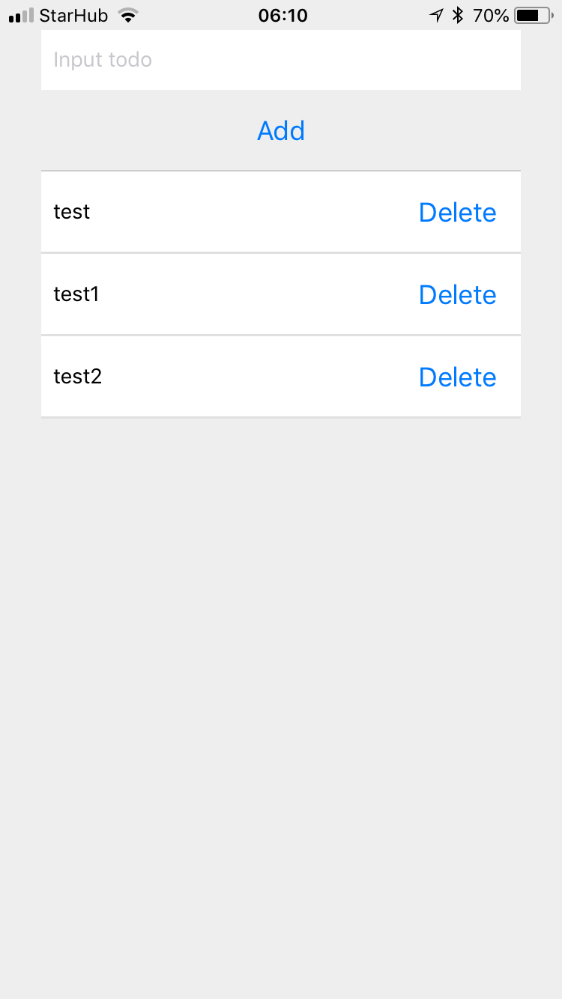

# Add ToDo List style

將 ToDo List 加上樣式調整

## 目前的畫面

## 預期調整成的樣子

## 練習資源

練習基底： [https://snack.expo.io/@dmoon/react-native-todo-app-sample](https://snack.expo.io/@dmoon/react-native-todo-app-sample)

參考範例： [https://snack.expo.io/@dmoon/react-native-todo-app-with-styles-sample](https://snack.expo.io/@dmoon/react-native-todo-app-with-styles-sample)
