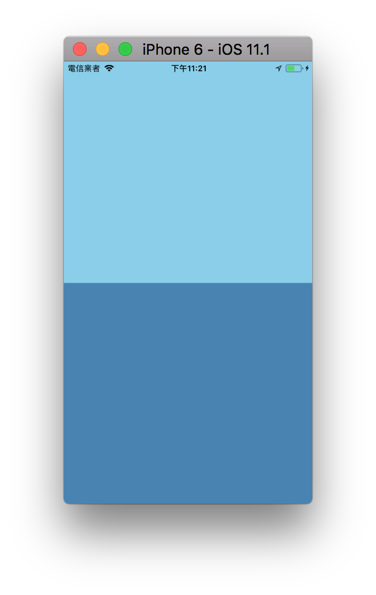
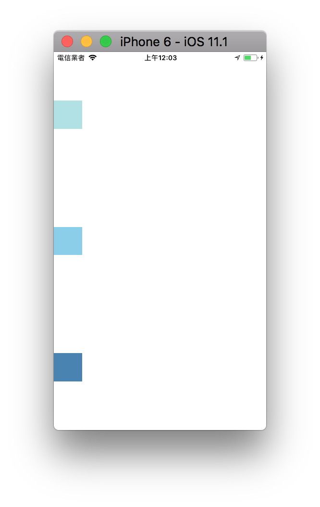

# Flex

Flexbox，可以在不同屏幕尺寸上提供一致的佈局結構，主要使用比例進行空間分配，能夠簡單完成置左、置中、置右、平均分散等佈局需求，是 React Native 主要使用的佈局方式。

雖然跟網頁 CSS 的 flex 很像，但還是有些微的差異
例如: flexDirection 在網頁中預設是 row，而在 RN 裡面預設為 column

**flex 的數值代表的是所佔的比例**

```js
<View style={{ flex: 1 }}>
  <View style={{ flex: 2, backgroundColor: 'skyblue' }} />
  <View style={{ flex: 1, backgroundColor: 'steelblue' }} />
</View>
```

在這個範例中 skyblue 與 steelblue 兩個 view 的高度比例會呈現 2 : 1，如下圖


**flexDirection**

決定佈局的 `主軸`可設定子元素是水平排列還是垂直排列

- column 垂直排列 (預設)
- row 水平排列

預設為垂直排列

```javascript
<View style={{ flex: 1 }}>
  <View style={{ flex: 1, backgroundColor: 'skyblue' }} />
  <View style={{ flex: 1, backgroundColor: 'steelblue' }} />
</View>
```



使用 flexDirection 設定為水平排列

```javascript
<View style={{ flex: 1, flexDirection: 'row' }}>
  <View style={{ flex: 1, backgroundColor: 'skyblue' }} />
  <View style={{ flex: 1, backgroundColor: 'steelblue' }} />
</View>
```


**justifyContent**

可以決定其子元素沿着 `主軸` 的排列方式

- flex-start 主軸起始位置
- center 主軸中心
- flex-end 主軸末端
- space-around 根據主軸均勻分布空白
- space-between 根據主軸均勻分布物件

flex-start


center


flex-end


space-around



space-between


**alignItems**
可以決定其子元素沿着 `次軸` 的排列方式

- flex-start 次軸起始位置
- center 次軸中心
- flex-end 次軸末端

## 使用範例

```js
import React, { Component } from 'react';
import { StyleSheet, View, Image, Text } from 'react-native';

export default class FlexSample extends Component {
  render() {
    return (
      <View style={{ flex: 1 }}>
        <View style={{ flex: 1, backgroundColor: 'blue' }}>
          <View
            style={{
              flex: 1,
              backgroundColor: 'red',
              flexDirection: 'column',
              justifyContent: 'flex-start',
              alignItems: 'flex-end'
            }}
          >
            <Text style={{ color: 'white' }}>右上</Text>
          </View>
          <View
            style={{
              flex: 3,
              backgroundColor: 'green',
              justifyContent: 'center',
              alignItems: 'center'
            }}
          >
            <Text style={{ color: 'white' }}>置中</Text>
          </View>
        </View>
        <View
          style={{ flex: 1, flexDirection: 'row', backgroundColor: 'blue' }}
        >
          <View
            style={{
              flex: 1,
              backgroundColor: 'blue',
              flexDirection: 'row',
              justifyContent: 'flex-end',
              alignItems: 'flex-start'
            }}
          >
            <Text style={{ color: 'white' }}>右上？</Text>
          </View>
          <View
            style={{
              flex: 1,
              backgroundColor: 'yellow',
              alignItems: 'center',
              justifyContent: 'space-between'
            }}
          >
            <Text>1</Text>
            <Text>2</Text>
            <Text>3</Text>
          </View>
        </View>
      </View>
    );
  }
}
```


Flex 線上範例:　[https://snack.expo.io/@dmoon/flex-sample](https://snack.expo.io/@dmoon/flex-sample)

FlexDirection 線上範例：[https://snack.expo.io/@dmoon/flexdirection-sample](https://snack.expo.io/@dmoon/flexdirection-sample)

## 練習

FlexBox Froggy: [http://flexboxfroggy.com/](http://flexboxfroggy.com/) - 用遊戲學習 css flexbox
玩到第 12 關

## 延伸閱讀

yoga: [https://github.com/facebook/yoga](https://github.com/facebook/yoga) - Facebook 實作的跨平台 Flex library
