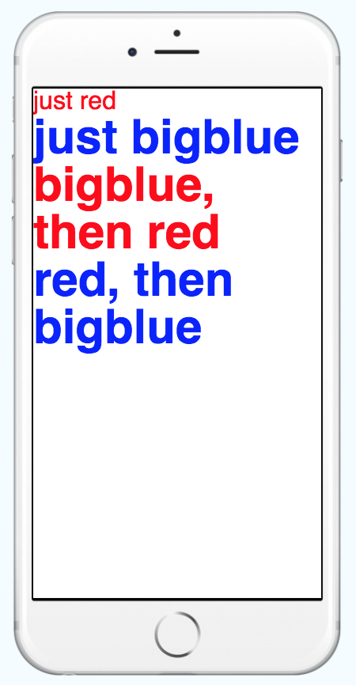

# Style

- 架構 Component 樣式的元素
- 使用 Object 來編寫樣式屬性
- style 等於是一個 props
- 遵循 web 上的 css 命名
- 駝峰式的屬性名稱，css 命名改為小駝峰
  例如: `font-size` 在 React Native 為 `fontSize`
- style props 可以傳入 array ，若有同屬性的樣式，後面的會蓋掉前面的
- StyleSheet 是一個類似 CSS StyleSheets 的抽象層
- 普通元件不支援 transform，需轉換成動畫元件才能使用

## StyleSheet 優點

- 提高程式質量
  - 從 render 當中的抽離 inline-style 樣式，可以使程式碼更清晰易懂
  - 給樣式命名對於 Component 可以提高可讀性
- 提高性能
  - 創建樣式表，後續可以通過 ID 來引用樣式，而不是每次都創建新的對象
  - 使用 StyleSheet 新增 style object，可以把樣式變成 ID 往 child component 傳遞，提高效能

### 傳入 Object

```javascript
// 這種寫法稱為 inline-style
<Text style={{ fontSize: 16, color: '#ff0000' }}>just red</Text>
```

### 傳入 Array

```javascript
const textStyle = [
  {
    fontSize: 16,
    color: '#ff0000'
  },
  {
    fontWeight: 'bold'
  }
];
<Text style={textStyle}>just red</Text>;
```

根據變數切換 style

```javascript
const redStyle= {
  color: '#ff0000',
};
const isRed = true;

<Text style={[{ fontWeight: 'bold' }, isRed && redStyle]}>just red</Text>

// 或是

<Text style={[{ fontWeight: 'bold' }, isRed ? redStyle : {}]}>just red</Text>
```

### 使用 StyleSheet

```javascript
const styles = StyleSheet.create({
  big: {
    fontWeight: 'bold',
    fontSize: 16,
  },
  red: {
    color: 'red',
  },
});
<Text style={styles.red}>just red</Text>
<Text style={[ styles.big, styles.red]}>just red</Text>
```

## 完整範例

```javascript
import React, { Component } from 'react';
import { StyleSheet, Text, View } from 'react-native';

export default class LotsOfStyles extends Component {
  render() {
    return (
      <View>
        <Text style={{ fontSize: 16, color: '#ff0000' }}>just red</Text>
        <Text style={styles.bigblue}>just bigblue</Text>
        <Text style={[styles.bigblue, styles.red]}>bigblue, then red</Text>
        <Text style={[styles.red, styles.bigblue]}>red, then bigblue</Text>
      </View>
    );
  }
}

const styles = StyleSheet.create({
  bigblue: {
    color: 'blue',
    fontWeight: 'bold',
    fontSize: 30
  },
  red: {
    color: 'red'
  }
});
```



expo 範例: [https://snack.expo.io/r1TNAdlIf](https://snack.expo.io/r1TNAdlIf)

## 進階使用

### 根據不同裝置顯示 style 1

```javascript
import { StyleSheet, Platform } from 'react-native';

const styles = StyleSheet.create({
  text: {
    fontSize: 16,
    ...Platform.select({
      ios: {
        color: 'red'
      },
      android: {
        color: 'blue'
      }
    })
  }
});
<Text style={styles.text} />;
```

### 根據不同裝置顯示 style 2

F8APP 封裝 StyleSheet

```javascript
export function create(styles) {
  const platformStyles = {};
  Object.keys(styles).forEach(name => {
    let { ios, android, ...style } = { ...styles[name] };
    if (ios && Platform.OS === 'ios') {
      style = { ...style, ...ios };
    }
    if (android && Platform.OS === 'android') {
      style = { ...style, ...android };
    }
    platformStyles[name] = style;
  });
  return StyleSheet.create(platformStyles);
}
```

#### 使用 F8StyleSheet

```javascript
import F8StyleSheet from 'F8StyleSheet.js';
const styles = F8StyleSheet.create({
  text: {
    fontSize: 16,
    ios: {
      color: 'red'
    },
    android: {
      color: 'blue'
    }
  }
});
<Text style={styles.text} />;
```

#### 動畫 Style

```javascript
state = {
  fadeAnim: new Animated.Value(0),  0
}

Animated.timing(                  // Animate over time
  this.state.fadeAnim,            // The animated value to drive
  {
    toValue: 1,                   // Animate to opacity: 1 (opaque)
    duration: 10000,              // Make it take a while
  }
).start();

<Animated.View                 // Special animatable View
  style={{
    opacity: this.state.fadeAnim,         // Bind opacity to animated value
  }}
>
  {this.props.children}
</Animated.View>
```

延伸閱讀

- 解構賦值: [https://developer.mozilla.org/zh-TW/docs/Web/JavaScript/Reference/Operators/Destructuring_assignment](https://developer.mozilla.org/zh-TW/docs/Web/JavaScript/Reference/Operators/Destructuring_assignment)
