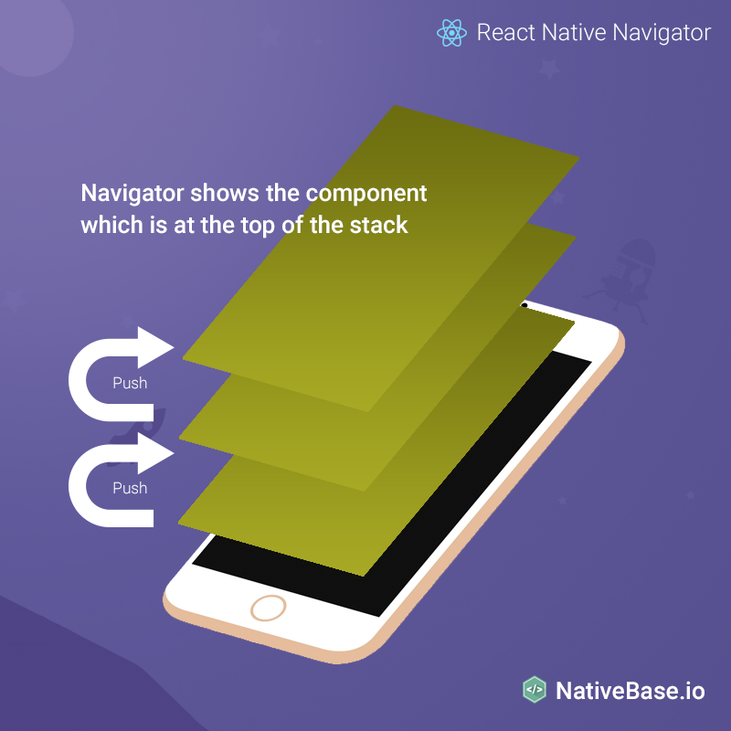
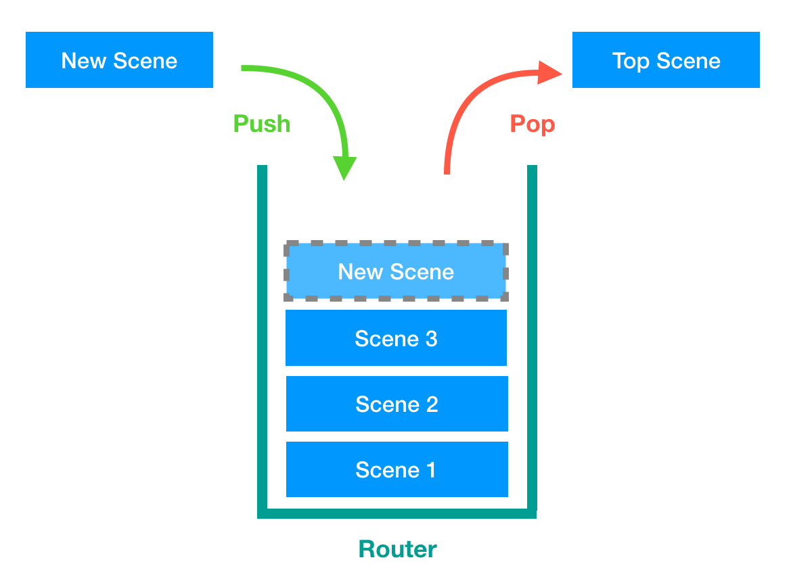

# Navigation 切換畫面

## Navigation 套件

- [react-navigation](https://github.com/react-navigation/react-navigation)
- [react-native-router-flux](https://github.com/aksonov/react-native-router-flux)
- [react-native-navigation](https://github.com/wix/react-native-navigation)

## Install

```bash
# install package
$ yarn add react-native-router-flux
```

## 範例專案

[Example Project](https://github.com/agileworks-tw/RNRF-examples)

## Route 管理概念

### Router Stack





### RNRF Usage

1.  將每個畫面包裝成一個 Component
2.  定義 Router
    宣告 Scene 對應的 Component

```javascript
import { Router, Stack, Scene } from 'react-native-router-flux';
/* render */
<Router>
  <Stack key="root">
    <Scene key="login" component={Login} title="Login" />
    <Scene key="register" component={Register} title="Register" />
    <Scene key="home" component={Home} />
  </Stack>
</Router>;
```

3.  使用 Actions 處理畫面跳轉

```javascript
Actions.sceneKey();
```

### API

- Actions.SCENE_KEY()
- Actions.pop()
- Actions.refresh()

### 畫面間資料傳遞

透過 Actions 方法

```javascript
const paramData = {
  // place data here
};
Actions.anotherPage(paramData);
```
