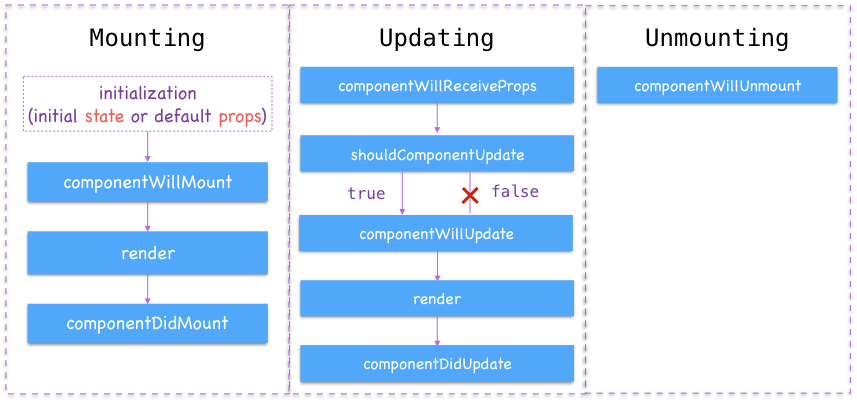
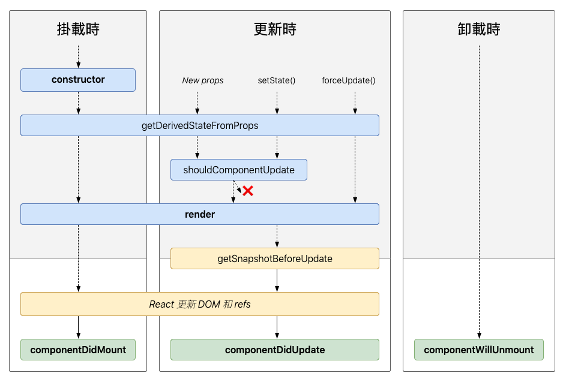

# Lifecycle

> 組件的生命週期

- Old LifeCycle



- React 16.4 LifeCycle



[React LifeCycle Diagram: http://projects.wojtekmaj.pl/react-lifecycle-methods-diagram/](http://projects.wojtekmaj.pl/react-lifecycle-methods-diagram/)

## render

- 每個 React Component 都必需定義的方法，負責繪製 UI 的結構（Virtual DOM 節點結構）
- 必須 return 僅一個 React Element，所以 Component 結構第一層才只能有一個節點

- 每次 Component 成功重繪的生命週期中都會被呼叫到並執行

## componentDidMount

- 在 Component 初始化並且首次繪製完成實際 UI 後觸發，重繪時不會觸發
- 在 Component 的實際 UI 從畫面中移除之前，只會發生一次
- 通常一些首次進入畫面後想發生的事情就適合在這裡呼叫，例如發送 HTTP Request 向後端 API 請求資料

```js
class Example extends React.Component {
  componentDidMount() {
    // ...
  }
}
```

> #### 練習： DidMount Sample: [https://snack.expo.io/@dmoon/didmount-sample](https://snack.expo.io/@dmoon/didmount-sample)

## componentDidUpdate

> 不能在沒有條件下進行 setState，否則會無窮迴圈
> 一般會透過新舊比較 ( prevProps 與 this.props ) 或是 ( this.props 與 nextProps )，state 比較異同，再更新 state

```js
class Example extends React.Component {
  componentDidUpdate(prevProps) {
    // Typical usage (don't forget to compare props):
    if (this.props.userID !== prevProps.userID) {
      this.fetchData(this.props.userID);
    }
  }
}
```


## get­Derived­State­From­Props(nextProps, prevState)

get­Derived­State­From­Props 主要是對比到原先的 componentWillReceiveProps，可以透過回傳一個 object 來更新 state，如果不更新就必須回傳 null。

get­Derived­State­From­Props 帶有兩個參數 nextProps, prevState，更新後的 props，先前的 state，這個 method 在初始 render 調用，還有父元件重新 render 時也會調用。

```js
class Example extends React.Component {
  static getDerivedStateFromProps(props, state) {
    // ...
  }
}
```

## getSnapshotBeforeUpdate

getSnapshotBeforeUpdate 方法可以回傳值，回傳的值能夠在 componentDidUpdate 方法的參數收到。

```js
class Example extends React.Component {
  getSnapshotBeforeUpdate(prevProps, prevState) {
    // ...
  }
}
```

範例

```js
class ScrollingList extends React.Component {
  listRef = React.createRef();

  getSnapshotBeforeUpdate(prevProps, prevState) {
    // Are we adding new items to the list?
    // Capture the current height of the list so we can adjust scroll later.
    if (prevProps.list.length < this.props.list.length) {
      return this.listRef.current.scrollHeight;
    }
    return null;
  }

  componentDidUpdate(prevProps, prevState, snapshot) {
    // If we have a snapshot value, we've just added new items.
    // Adjust scroll so these new items don't push the old ones out of view.
    if (snapshot !== null) {
      this.listRef.current.scrollTop +=
        this.listRef.current.scrollHeight - snapshot;
    }
  }

  render() {
    return (
      <div ref={this.listRef}>{/* ...contents... */}</div>
    );
  }
}
```

## React v16.9.0 更新

### React v16.9.0 後將容易誤用的生命週期方法進行更名，舊的方法依然可以使用，但會出現 warning

- componentWillMount → UNSAFE_componentWillMount
- componentWillReceiveProps → UNSAFE_componentWillReceiveProps
- componentWillUpdate → UNSAFE_componentWillUpdate

若想知道 React 16.3 之後的生命週期更新，可以參考 [Migrate 文件：https://reactjs.org/blog/2018/03/27/update-on-async-rendering.html#migrating-from-legacy-lifecycles](https://reactjs.org/blog/2018/03/27/update-on-async-rendering.html#migrating-from-legacy-lifecycles)，


#### 若想對專案舊有的生命週期進行更名，可以用這個指令

```bash
cd your_project
npx react-codemod rename-unsafe-lifecycles
```