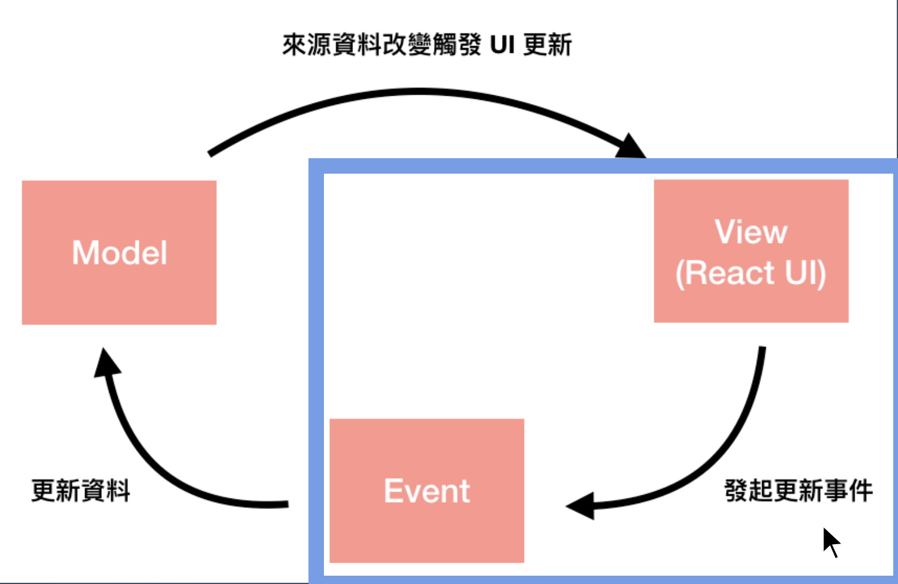

# React 更新的兩個觀念

- One-way Data Flow
- Always Redraw

## One-way Data Flow

> 單向資料流
> UI 是應用程式的資料去延伸的顯示結果
> 只有因為資料改變，才能導致 UI 的顯示結果自動跟著改變

- 這個因果關係永遠不能逆向

- UI 只能被動的隨資料而反應變化

- UI 不能反過來主動直接修改資料或是修改 UI 自己的顯示結果

## Always Redraw

- 每次都重繪全部的實體 DOM 在效能考量之下是不可行的，但是重繪 Virtual DOM 的成本相對降低許多，因此 React 實作了一套 Reconciliation 演算法來實現這個概念與流程
- React 如何實現單向資料流：
  - 當 UI 的來源資料有變化時 ( 透過 Watcher 監聽 )，依照新的資料重新產生 Virtual DOM，透過 Reconciliation 演算法與舊的 Virtual DOM 比較出差異的地方，並計算出最有效率的更新方法，在實際的 DOM 上進行操作更新

### Reconciliation

> Virtual DOM Diff 演算法

## Thinking in React

- 定義資料和 UI 的規則關係
- 在 UI 應該更新時，只透過更新資料來觸發 React 的 always redraw ，進行重繪

