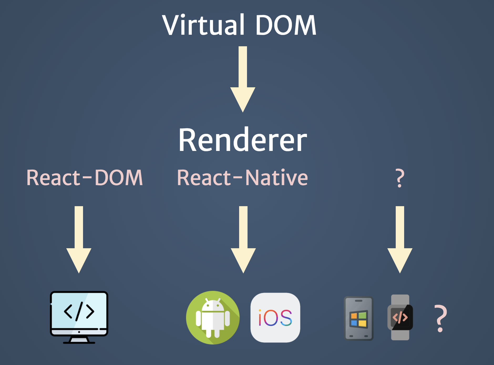

# React.JS 介紹

## 定義

> A JavaScript library for building user interfaces

構建跨平台 UI 的函式庫

## 角色

> 只負責處理 UI ，也就是 MVC 中的 View

- React 本身並不是一個完整的前端框架，而是一個只處理 View 的函式庫，提供開發者定義 UI 結構，並有一套自動操作更新 DOM 的機制
- React 是一個中間媒介，連結了 UI 的定義層面與 DOM 的實體層面

## Reconciler & Renderer

> 廣義的 React 可以再細分為 Reconciler 和 Renderer

- Reconciler（react）：將定義的 React UI 結構轉成虛擬的物件樹 Virtual DOM
- Renderer（react-native）：以這個虛擬結構作為依據，產生出對應的實際 DOM

### Reconciler

> UI 結構的設計圖

透過 JavaScript ( JSX ) 對 UI 結構進行宣告式的定義
React 會將結構自動轉變成一份虛擬的物件樹 : Virtual DOM

### Renderer

> 對應平台的原生 UI 渲染工具

- react-dom
- react-native
- react-tv
- react-vr
- react-native-windows

## React 進入點

> 原生應用上的元素，提供 React 進行應用渲染

## Learn Once, Write Anywhere

> Reconciler + Renderer = Learn Once, Write Anywhere
