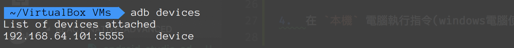

# VM 使用教學

## 取得 VM 相關檔案

跟講師領取隨身碟或透過網路下載

## 前置準備

- 安裝 Virtual Box

- 安裝 Genymotion

- 將虛擬機檔案 `ReactNative.ova` 匯入 VirtualBox

## VM 環境設定

[環境使用教學影片](https://youtu.be/2m7YyRycMhE)
**請依照順序操作**

### 啟動模擬器與虛擬機

1.  開啟 Genymotion
2.  開啟 Genymotion 當中的 Android 虛擬機 **Custom Phone - 7.1.0 - API 25 - 768x1280**，等待開機完成
3.  開啟 VirtualBox 當中的 ReactNative 虛擬機，待虛擬機出現 login 字樣後，開啟網頁 http://localhost:9083/ide.html

    之後會透過這個頁面來進行虛擬機內的操作
    

###  將模擬器連接到 ReactNative VM 環境

> **此動作每次重啟  Genymotion 裝置或 ReactNative VM 都需要重做一次!!!**

1.   在 `本機` 電腦執行指令(windows 電腦使用命令提示字元執行)

> 本機有安裝 Android Studio 的請略過此步驟，並照下方 `安裝問題 adb 版本衝突`　的步驟處理，處理完後再回來從 `第2點　到 ReactNative 虛擬機網頁當中的 terminal 視窗輸入指令`　繼續步驟

```bash
# 先進入下載的環境資源包中 adb 檔案所在的目錄，然後執行以下指令
$ adb devices
# 執行後會看到 android 模擬器的 ip 位址(可能每次都會不同)，請先將這個位址複製下來，待會會用到
$ adb tcpip 5556
```



2.  到 `ReactNative 虛擬機網頁當中的 terminal` 視窗輸入指令

```bash
$ adb connect $ip:5556
/* $ip 請自行替換為 adb devices 回傳的 Android 虛擬機 IP 例如: adb connect 192.168.57.101:5556 */
$ adb devices
/* 測試是否有連上 */
```


## 安裝問題

### adb 版本衝突 (adb server version doesn't match this client killing...)

!!!  請先到 一般環境設定章節 確認 Android Studio 的 SDK Manager 所需的相關套件都有下載安裝 ！！！

1.  打開 Genymotion
2.  找到 設定 > adb
3.  選擇 Use custom Android SDK tools
4.  打開 Android Studio 找到 SDK Manager 中的 SDK  檔案路徑，複製下來


5.  回到 Genymotion，在下面 Android SDK 輸入框中填入 Android Studio 的路徑


6.  重啟 Genymotion，重啟後記得再依照前面的 `將模擬器連接到 ReactNative VM 環境` 步驟做一次

由於您的本機已經有全域的 adb 了，不需要再使用教材的 adb 檔案來執行指令，
直接使用全域的 adb 執行指令，指令如下

```bash
# 進入下載的 adb 檔案所在目錄
$ adb devices
# 執行後會看到 android 模擬器的 ip 位址(可能每次都會不同)，請先將這個位址複製下來，待會會用到
$ adb tcpip 5556
```

## 確認操作成功

參考 https://youtu.be/2m7YyRycMhE?t=130 操作

## 常見問題

[常見問題](http://bbs.reactnative.cn/topic/130/%E6%96%B0%E6%89%8B%E6%8F%90%E9%97%AE%E5%89%8D%E5%85%88%E6%9D%A5%E8%BF%99%E9%87%8C%E7%9C%8B%E7%9C%8B-react-native%E7%9A%84%E5%B8%B8%E8%A7%81%E9%97%AE%E9%A2%98)

## 延伸閱讀

- 官方文件 Android 開發環境 - for Mac: [http://facebook.github.io/react-native/releases/0.44/docs/getting-started.html#android-development-environment](http://facebook.github.io/react-native/releases/0.44/docs/getting-started.html#android-development-environment)
- 官方文件 Android 開發環境 - for Windows: [http://facebook.github.io/react-native/releases/0.44/docs/getting-started.html#android-development-environment](http://facebook.github.io/react-native/releases/0.44/docs/getting-started.html#android-development-environment)
- 簡中環境教學: [http://reactnative.cn/docs/0.47/getting-started.html](http://reactnative.cn/docs/0.47/getting-started.html)
