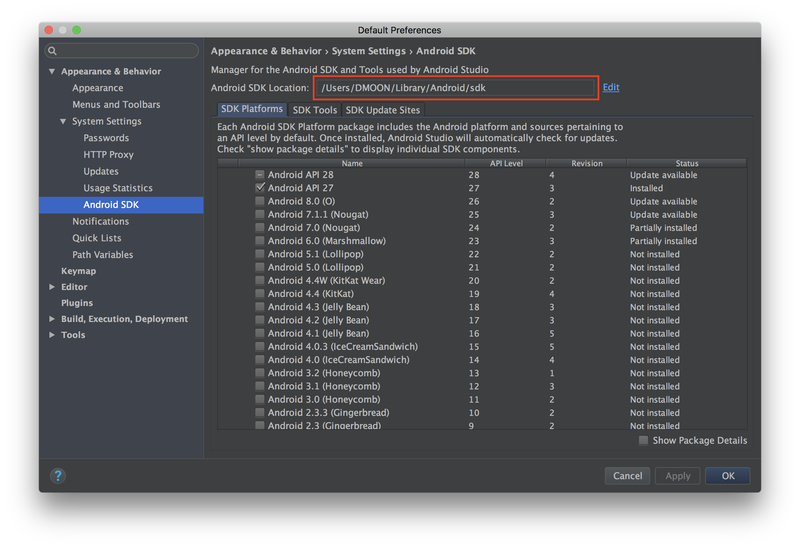
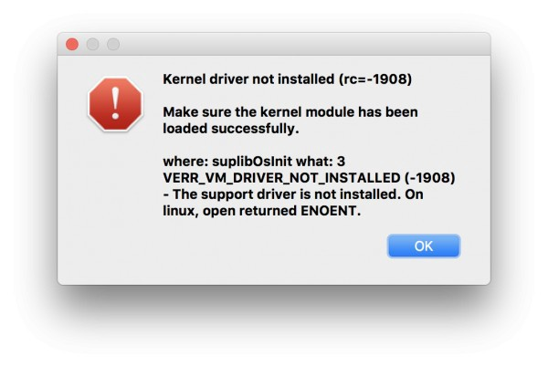
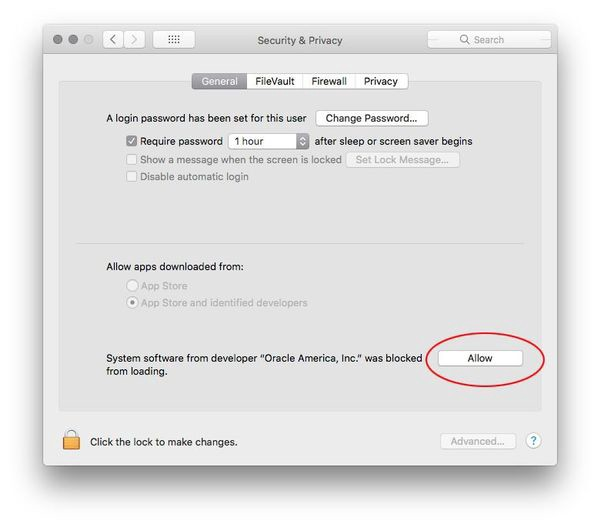

# VM 使用教學

## 取得 VM 相關檔案

跟講師領取隨身碟或透過網路下載

## 前置準備

- 安裝 `VirtualBox (version 6.0.10)` 和 `Genymotion (version 3.0.2)`

  - Windows:

    > 從 ReactNative 教材中的 `Windows` 資料夾中可以找到 Genymotion 安裝檔（genymotion-3.0.2-vbox），Windows 的 Genymotion 安裝檔已經包含 VirtualBox，直接安裝即可

  - macOS:

    >  請到 ReactNative 教材中的 `Mac` 資料夾中可以找到 VirtualBox 安裝檔來進行安裝，安裝完 VirtualBox 後，再使用同資料夾中的 Genymotion 安裝檔來安裝 Genymotion

- 打開 VirtualBox ，匯入教材中的 Android 模擬器檔案 `Custom Phone - 7.1.0 - API 25 - 768x1280_with_GApps`

- 在 VirtualBox 中匯入教材中的另一個 ReactNative 環境虛擬機檔案 `ReactNative.ova`


## VM 環境設定

環境使用教學影片: [https://youtu.be/2m7YyRycMhE](https://youtu.be/2m7YyRycMhE)
**請依照順序操作**

### 啟動模擬器與虛擬機

1. 開啟 Genymotion（需要註冊：[https://cloud.geny.io](https://cloud.geny.io))

2. Usage 選擇 `Personal Use`
  

3.  開啟 Genymotion 當中的 Android 模擬器 **Custom Phone - 7.1.0 - API 25 - 768x1280**，等待開機完成 (如果沒有看見 Android 模擬器，可能是在匯入完成前就已經開啟 Genymotion，請重開 Genymotion)


4.  開啟 VirtualBox 當中的 ReactNative 虛擬機，待虛擬機出現 login 字樣後，表示已經成功啟動，這邊不需理會登入訊息，也不需做登入動作，接下來請用瀏覽器開啟網址 [http://localhost:9083/ide.html](http://localhost:9083/ide.html)，這是剛剛啟動的虛擬機掛載的網頁操作介面，之後都會透過這個網頁來進行虛擬機內的操作
    

    

###  將模擬器連接到 ReactNative VM 環境

> **此動作每次重啟 Genymotion 裝置或 ReactNative VM 都需要重做一次!!!**

> 如果你的電腦已經有安裝 Android Studio 或是 adb，請跳到底下的[adb 版本衝突](#adb版本衝突)

1. 取得 android 裝置IP位址

   ## 執行批次指令

   #### Windows

   打開 `ReactNative教材/Windows/android_device.bat` ，執行視窗會列出找到的 android 裝置 IP，將 IP 位址複製下來

   #### macOS

   打開 terminal 執行

   ```sh
   cd /Applications/Genymotion.app/Contents/MacOS/tools
   ./adb devices
   ./adb tcpip 5556
   ```

   將執行結果顯示的 IP 位址複製下來

2.  到 `ReactNative 虛擬機網頁當中的 terminal` 視窗輸入指令

  ```bash
  $ adb connect $ip:5556
  # $ip 請自行替換為 adb devices 回傳的 Android 虛擬機 IP 例如:
  # adb connect 192.168.57.101:5556

  # 測試是否有連上
  $ adb devices
  ```


### adb版本衝突

> **如果你的電腦已經有安裝 Android Studio 或是 adb，才需要做這個步驟，若無請略過 **

`Error message: adb server version doesn't match this client killing...`

!!!  請先到 一般環境設定章節 確認 Android Studio 的 SDK Manager 所需的相關套件都有下載安裝 !!!

1.  打開 Genymotion
2.  找到 設定 > adb
3.  選擇 Use custom Android SDK tools
4.  打開 Android Studio 找到 SDK Manager 中的 SDK  檔案路徑，複製下來

  

  

5.  回到 Genymotion，在下面 Android SDK 輸入框中填入 Android Studio 的路徑

  

  

6. 由於您的本機已經有全域的 adb 了，不需要再使用教材的 adb 檔案來執行指令，
直接使用全域的 adb 執行指令，指令如下

  ```bash
  # 進入下載的 adb 檔案所在目錄
  $ adb devices
  # 執行後會看到 android 模擬器的 ip 位址(可能每次都會不同)，請先將這個位址複製下來，待會會用到
  $ adb tcpip 5556
  ```

7. 將執行結果顯示的 IP 位址複製下來

  到 ReactNative 虛擬機網頁當中的 terminal 視窗輸入指令

  ```bash
  $ adb connect $ip:5556
  # $ip 請自行替換為 adb devices 回傳的 Android 虛擬機 IP 例如:
  # adb connect 192.168.57.101:5556

  # 測試是否有連上
  $ adb devices
  ```


## 確認操作成功

用瀏覽器開啟 [localhost:9083](localhost:9083) ，在 cloud9 編輯器操作介面的 tab 開啟 Terminal 終端機

```bash
# 新增一個 Terminal tab
react-native init demo
cd demo
npm start

# 新增一個 Terminal tab
cd demo
react-native run-android
```

相關步驟可以參考影片 https://youtu.be/2m7YyRycMhE?t=130 操作

## 常見問題

### Kernel driver not installed (rc=-1908)



開啟 `系統偏好設定 (System Preferences)` 中的 `安全性與隱私權（Security & Privacy）`

允許 `Oracle America, Inc.`



### **Your CPU is incompatible with virtualization technologies**


進入 BIOS 設定開啟 CPU 虛擬化

1. 重新開機，按住 delete 鍵，進入 BIOS
2. 進入選單：Advanced Mode > Advanced > CPU Configuratio ，開啟以下選項
  - Virtualization Technology: Enabled
  - VT-x: Enabled

### 手動取得 android 裝置位址

在 `本機` 電腦執行指令(windows 電腦使用命令提示字元執行)

> 本機有安裝 Android Studio 的請略過此步驟，並照下方 [adb版本衝突](#adb版本衝突) 的步驟處理

```bash
# 先進入 Genymotion 附設的 adb 檔案所在的目錄
## windows 參考路徑
cd C:\Program Files\Genymobile\Genymotion\tools
## macOS 參考路徑
cd /Applications/Genymotion.app/Contents/MacOS/tools

# 執行 adb 指令
$ adb devices
# 執行後會看到 android 模擬器的 ip 位址(可能每次都會不同)，請先將這個位址複製下來，待會會用到

# 修改裝置 port 號到 5556
$ adb tcpip 5556
```


[其他常見問題](http://bbs.reactnative.cn/topic/130/%E6%96%B0%E6%89%8B%E6%8F%90%E9%97%AE%E5%89%8D%E5%85%88%E6%9D%A5%E8%BF%99%E9%87%8C%E7%9C%8B%E7%9C%8B-react-native%E7%9A%84%E5%B8%B8%E8%A7%81%E9%97%AE%E9%A2%98)


## 延伸閱讀

- 官方文件 Android 開發環境 - for Mac: [http://facebook.github.io/react-native/releases/0.44/docs/getting-started.html#android-development-environment](http://facebook.github.io/react-native/releases/0.44/docs/getting-started.html#android-development-environment)
- 官方文件 Android 開發環境 - for Windows: [http://facebook.github.io/react-native/releases/0.44/docs/getting-started.html#android-development-environment](http://facebook.github.io/react-native/releases/0.44/docs/getting-started.html#android-development-environment)
- 簡中環境教學: [http://reactnative.cn/docs/0.47/getting-started.html](http://reactnative.cn/docs/0.47/getting-started.html)

