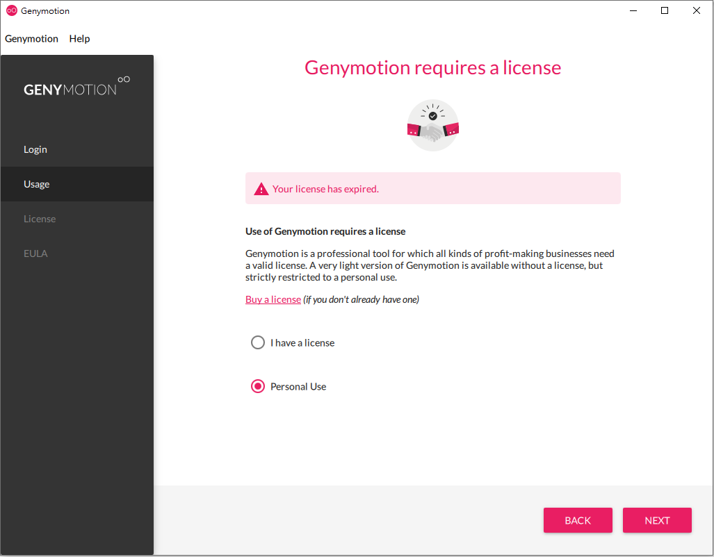
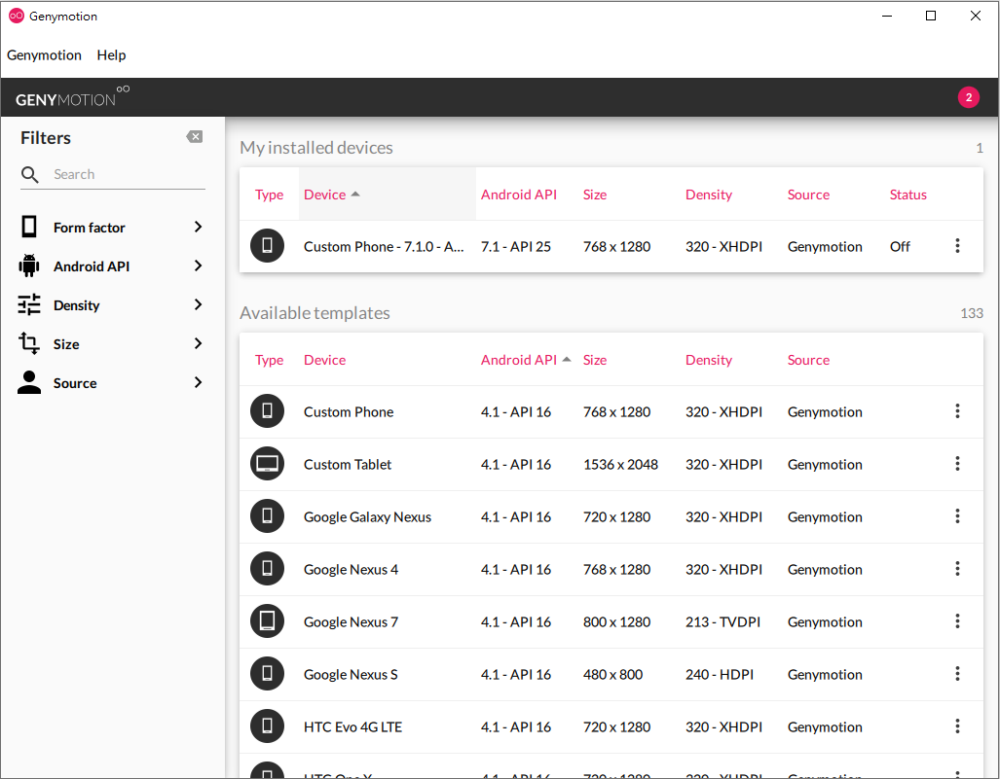
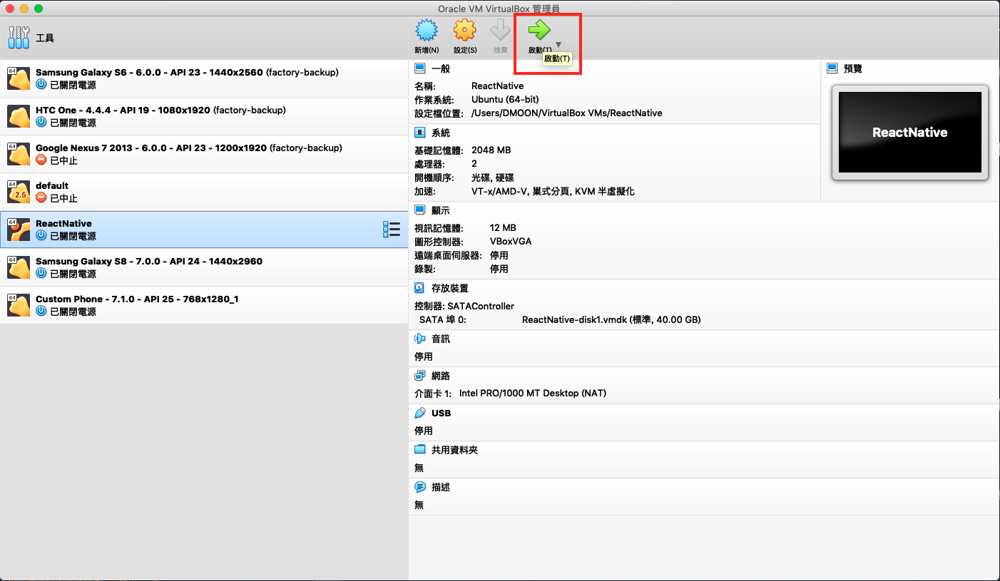

# VM 使用教學

## 取得 VM 相關檔案

跟講師領取隨身碟或透過網路下載

## 前置準備

- 安裝 `VirtualBox (version 6.0.10)` 和 `Genymotion (version 3.0.2)`

  - Windows:

    > 從 ReactNative 教材中的 `Windows` 資料夾中可以找到 Genymotion 安裝檔（genymotion-3.0.2-vbox），Windows 的 Genymotion 安裝檔已經包含 VirtualBox，直接安裝即可

  - macOS:

    >  請到 ReactNative 教材中的 `Mac` 資料夾中可以找到 VirtualBox 安裝檔來進行安裝，安裝完 VirtualBox 後，再使用同資料夾中的 Genymotion 安裝檔來安裝 Genymotion

- 打開 VirtualBox ，匯入教材中的 Android 模擬器檔案 `Custom Phone - 7.1.0 - API 25 - 768x1280_with_GApps`

- 在 VirtualBox 中匯入教材中的另一個 ReactNative 環境虛擬機檔案 `ReactNative.ova`


## VM 環境設定

環境使用教學影片: [https://youtu.be/2m7YyRycMhE](https://youtu.be/2m7YyRycMhE)
**請依照順序操作**

### 啟動模擬器與虛擬機

1. 開啟 Genymotion（需要註冊：[https://cloud.geny.io](https://cloud.geny.io))

2. Usage 選擇 `Personal Use`
  

3.  開啟 Genymotion 當中的 Android 模擬器 **Custom Phone - 7.1.0 - API 25 - 768x1280**，等待開機完成 (如果沒有看見 Android 模擬器，可能是在匯入完成前就已經開啟 Genymotion，請重開 Genymotion)


4.  開啟 VirtualBox 當中的 ReactNative 虛擬機，待虛擬機出現 login 字樣後，表示已經成功啟動，這邊不需理會登入訊息，也不需做登入動作，接下來請用瀏覽器開啟網址 http://localhost:9083/ide.html，這是剛剛啟動的虛擬機掛載的網頁操作介面

    之後都會透過這個頁面來進行虛擬機內的操作
    

    

###  將模擬器連接到 ReactNative VM 環境

> **此動作每次重啟 Genymotion 裝置或 ReactNative VM 都需要重做一次!!!**

1. 取得 android 裝置IP位址

   ## 執行批次指令

   #### Windows

   打開 `ReactNative教材/Windows/android_device.bat` ，執行視窗會列出找到的 android 裝置 IP，將 IP 位址複製下來

   #### macOS

   打開 terminal

   ```sh
   cd ReactNative教材/Mac
   ./android_device.sh
   ```

   將執行結果顯示的 IP 位址複製下來

2.  到 `ReactNative 虛擬機網頁當中的 terminal` 視窗輸入指令

```bash
$ adb connect $ip:5556
# $ip 請自行替換為 adb devices 回傳的 Android 虛擬機 IP 例如:
# adb connect 192.168.57.101:5556

# 測試是否有連上
$ adb devices
```


## 安裝問題

### adb 版本衝突 (adb server version doesn't match this client killing...)

!!!  請先到 一般環境設定章節 確認 Android Studio 的 SDK Manager 所需的相關套件都有下載安裝 ！！！

1.  打開 Genymotion
2.  找到 設定 > adb
3.  選擇 Use custom Android SDK tools
4.  打開 Android Studio 找到 SDK Manager 中的 SDK  檔案路徑，複製下來


5.  回到 Genymotion，在下面 Android SDK 輸入框中填入 Android Studio 的路徑


6.  重啟 Genymotion，重啟後記得再依照前面的 `將模擬器連接到 ReactNative VM 環境` 步驟做一次

由於您的本機已經有全域的 adb 了，不需要再使用教材的 adb 檔案來執行指令，
直接使用全域的 adb 執行指令，指令如下

```bash
# 進入下載的 adb 檔案所在目錄
$ adb devices
# 執行後會看到 android 模擬器的 ip 位址(可能每次都會不同)，請先將這個位址複製下來，待會會用到
$ adb tcpip 5556
```

## 手動取得 android 裝置位址

在 `本機` 電腦執行指令(windows 電腦使用命令提示字元執行)

> 本機有安裝 Android Studio 的請略過此步驟，並照下方 `安裝問題 adb 版本衝突`　的步驟處理，處理完後再回來從 `第2點　到 ReactNative 虛擬機網頁當中的 terminal 視窗輸入指令`　繼續步驟

```bash
# 先進入 Genymotion 附設的 adb 檔案所在的目錄
## windows 參考路徑
cd C:\Program Files\Genymobile\Genymotion\tools
## macOS 參考路徑
cd /Applications/Genymotion.app/Contents/MacOS/tools

# 執行 adb 指令
$ adb devices
# 執行後會看到 android 模擬器的 ip 位址(可能每次都會不同)，請先將這個位址複製下來，待會會用到

# 修改裝置 port 號到 5556
$ adb tcpip 5556
```


## 確認操作成功

用瀏覽器開啟 [localhost:9083](localhost:9083) ，在 cloud9 編輯器操作介面的 tab 開啟 Terminal 終端機

```bash
# 新增一個 Terminal tab
cd RN_Todo_Sample
npm install
react-native start

# 另開一個 Terminal tab
cd RN_Todo_Sample
react-native run-android
```

相關步驟可以參考影片 https://youtu.be/2m7YyRycMhE?t=130 操作

## 常見問題

### Kernel driver not installed (rc=-1908)


開啟 `系統偏好設定 (System Preferences)` 中的 `安全性與隱私權（Security & Privacy）`

允許 `Oracle America, Inc.`


### **Your CPU is incompatible with virtualization technologies**


進入 BIOS 設定開啟 CPU 虛擬化

1. 重新開機，按住 delete 鍵，進入 BIOS
2. 進入選單：Advanced Mode > Advanced > CPU Configuratio ，開啟以下選項
  - Virtualization Technology: Enabled
  - VT-x: Enabled

[其他常見問題](http://bbs.reactnative.cn/topic/130/%E6%96%B0%E6%89%8B%E6%8F%90%E9%97%AE%E5%89%8D%E5%85%88%E6%9D%A5%E8%BF%99%E9%87%8C%E7%9C%8B%E7%9C%8B-react-native%E7%9A%84%E5%B8%B8%E8%A7%81%E9%97%AE%E9%A2%98)


## 延伸閱讀

- 官方文件 Android 開發環境 - for Mac: [http://facebook.github.io/react-native/releases/0.44/docs/getting-started.html#android-development-environment](http://facebook.github.io/react-native/releases/0.44/docs/getting-started.html#android-development-environment)
- 官方文件 Android 開發環境 - for Windows: [http://facebook.github.io/react-native/releases/0.44/docs/getting-started.html#android-development-environment](http://facebook.github.io/react-native/releases/0.44/docs/getting-started.html#android-development-environment)
- 簡中環境教學: [http://reactnative.cn/docs/0.47/getting-started.html](http://reactnative.cn/docs/0.47/getting-started.html)

