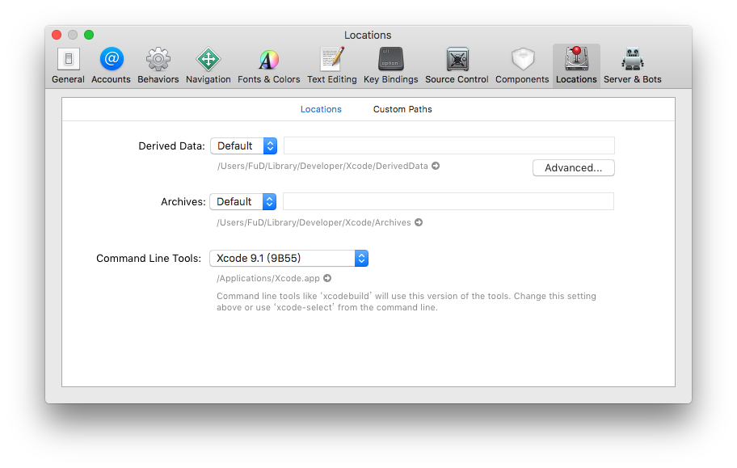

# 開發環境

基本系統環境

- python2
- jdk8
- Homebrew

## Node

### install NVM

Node Version Manager, 管理 Node 的工具，

#### Windows

- [nvm-windows](https://github.com/coreybutler/nvm-windows)

#### Mac

```bash
curl -o- https://raw.githubusercontent.com/creationix/nvm/v0.33.6/install.sh | bash
```

設定環境變數 (~/.bash_profile, ~/.zshrc, ~/.profile, or ~/.bashrc)

```bash
export NVM_DIR="$HOME/.nvm"
[ -s "$NVM_DIR/nvm.sh" ] && . "$NVM_DIR/nvm.sh" # This loads nvm
```

`source ~/.bashrc`

### install Node

```bash
nvm install 8
```

## Android SDK

React Native 目前需要 Android Studio2.0 或更高版本。

- 下載 Windows Android Studio [https://developer.android.com/studio/index.html](https://developer.android.com/studio/index.html)
- 安裝 Android Studio - 教學影片 [https://developer.android.com/studio/install.html](https://developer.android.com/studio/install.html)
- 安裝 SDK
  
  SDK Platforms 選擇 **Google APIs** 、 **Android SDK Platform 23**
  
  SDK Tools 選擇 **Android SDK Build-Tools 23.0.1**
  
  

### Android 環境變數

確保 ANDROID_HOME 環境變數跟 SDK 路徑一致

#### Windows

控制台 > 系統及安全性 > 進階系統設定 > 進階 > 環境變數 > 新增


控制台 > 系統及安全性 > 進階系統設定 > 進階 > 環境變數 > 選擇 PATH > 編輯
在後方新增  
`;C:\Users\使用者名稱\AppData\Local\Android\sdk\platform-tools;C:\Users\使用者名稱\AppData\Local\Android\sdk\tools`

#### Mac

開起 ~/.bashrc 或 ~/.zshrc 或 ~/.profile 在最後加上

```bash
export ANDROID_HOME=${HOME}/Library/Android/sdk
export PATH=${PATH}:${ANDROID_HOME}/tools
export PATH=${PATH}:${ANDROID_HOME}/platform-tools
```

## Android 虛擬機

- 註冊、下載 genymotion [https://goo.gl/H4elWA](https://www.genymotion.com/pricing-and-licensing/)
- 新增虛擬機
  

## Xcode

- 從 App Store 安裝 Xcode
- 安裝 Xcode Command Line Tools, Xcode > ToolBar > Locations > Preferences
  
- `xcode-select -p`，確認是否有安裝完成，安裝完成會回傳 `/Applications/Xcode.app/Contents/Developer`
- brew install watchman -

## Tools

- VS code
  - React Native Tools: [https://goo.gl/FRhoCI](https://marketplace.visualstudio.com/items?itemName=vsmobile.vscode-react-native)
  - ESLint [https://goo.gl/GonQQ9](https://marketplace.visualstudio.com/items?itemName=dbaeumer.vscode-eslint)
    - [設定 AirBnb EsLint](eslint.md)

## 免環境快速練習

### CRNA

```bash
npm install -g create-react-native-app
create-react-native-app AwesomeProject
cd AwesomeProject
npm start
```

### Expo snack

Expo Snack: [https://snack.expo.io/](https://snack.expo.io/)
