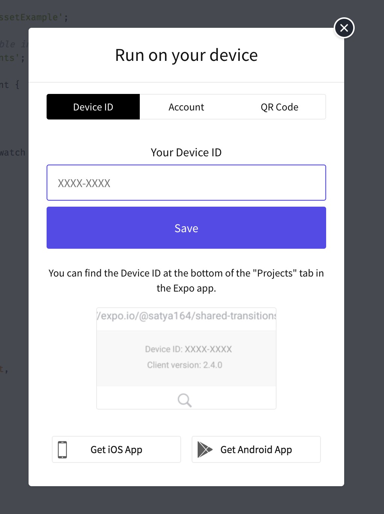
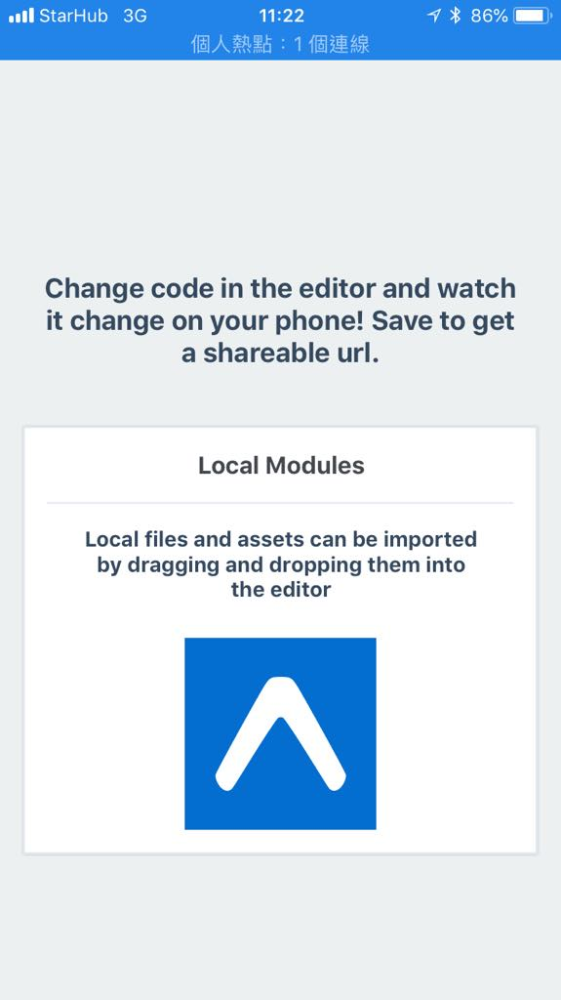

# Expo Snack

線上的 React Native playground
可以直接在線上建立專案，在網頁上的手機模擬器或是自己的手機上運行，並且包含 debug console 功能。

## 網址

Expo Snack : [https://snack.expo.io/](https://snack.expo.io/)

可以先註冊帳號

註冊帳號後可以儲存專案到服務帳號中進行管理

需要在手機上安裝 Expo App

- iOS: [https://goo.gl/Hh5jLm](https://goo.gl/Hh5jLm)
- Android: [https://goo.gl/0Xfx08](https://goo.gl/0Xfx08)

## 功能介紹

### Run On Device

用手機打開 Expo App 可以看到手機的 device id

填入之後下拉更新專案列表，可以看到線上的專案，點選後就會在手機上執行專案顯示畫面

