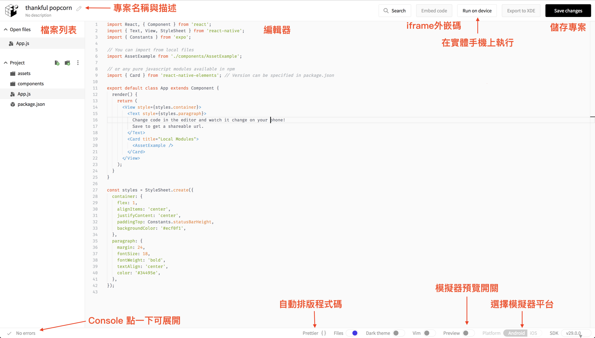
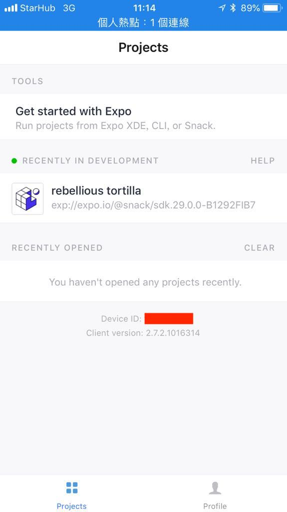

# Expo Snack

Expo Snack 是一個線上的 React Native playground，使用 Expo 的 SDK 執行
可以在線上建立一個簡單專案，並讓程式碼在網頁上的手機模擬器或是自己的手機上運行，並且包含 debug console 功能。

Expo Snack 並沒有辦法在線上打包 App，也不能隨意安裝其他套件，若想要有更多控制權，則需要輸出下載成 Expo 專案，然而 Expo 的專案缺少對原生專案的控制權，如果想要轉換回原本的 React Native 專案需要做 `eject` 處理，由於 Expo 專案情況會比較複雜，這邊我們就先暫時使用方便的 Expo Snack 線上環境來快速體驗 React Native，之後則會使用經典的 React Native 環境來創建專案。

> Expo v34.0 支援 web 預覽功能，可以將執行結果直接用 web 展示

## 網址

Expo Snack : [https://snack.expo.io/](https://snack.expo.io/)

可以先註冊帳號

註冊帳號後可以儲存專案到服務帳號中進行管理

需要在手機上安裝 Expo App

- iOS: [https://goo.gl/Hh5jLm](https://goo.gl/Hh5jLm)
- Android: [https://goo.gl/0Xfx08](https://goo.gl/0Xfx08)

## 功能介紹

### Run On Device

用手機打開 Expo App 可以看到手機的 device id

填入之後下拉更新專案列表，可以看到線上的專案，點選後就會在手機上執行專案顯示畫面

