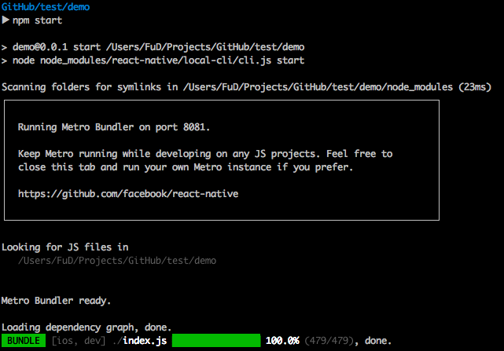

# 專案環境

## CLI

`$ npm install -g react-native-cli`

## 開新專案

```bash
react-native init demo
cd demo
npm start
react-native run-android
```

1.  `react-native init`

  - 新增乾淨的專案
  - [使用模板新增專案](template.md)

2.  `npm start`

  - 開啟 Bundle server
  - Bundle server 負責把 JavaScript 程式碼轉為 Native Code
  - 負責接收、傳送 Debug 訊息
    

3.  `react-native run-android`、`react-native run-ios`

  - 負責安裝開發模式的 react native app 至專案
  - 出現 `BUILD SUCCEEDED` 字樣代表完成
  - Android 編譯過 dev apk 後可直接使用下列指令安裝 apk 節省時間
    `adb install ./android/app/build/outputs/apk/app-debug.apk`

## 專案結構

```text
.
├── App.js
├── __tests__
├── android
├── app.json
├── index.js
├── ios
├── node_modules
├── package.json
└── yarn.lock
```

## 進入點

- index.js

```js
import {AppRegistry} from 'react-native';
import App from './App';
import {name as appName} from './app.json';

AppRegistry.registerComponent(appName, () => App);
```

## Root Component

- App.js

```js
import React, { Component } from 'react';
import { Platform, StyleSheet, Text, View } from 'react-native';

const instructions = Platform.select({
  ios: 'Press Cmd+R to reload,\n' + 'Cmd+D or shake for dev menu',
  android:
    'Double tap R on your keyboard to reload,\n' +
    'Shake or press menu button for dev menu'
});

export default class App extends Component<{}> {
  render() {
    return (
      <View style={styles.container}>
        <Text style={styles.welcome}>Welcome to React Native!</Text>
        <Text style={styles.instructions}>To get started, edit App.js</Text>
        <Text style={styles.instructions}>{instructions}</Text>
      </View>
    );
  }
}

const styles = StyleSheet.create({
  container: {
    flex: 1,
    justifyContent: 'center',
    alignItems: 'center',
    backgroundColor: '#F5FCFF'
  },
  welcome: {
    fontSize: 20,
    textAlign: 'center',
    margin: 10
  },
  instructions: {
    textAlign: 'center',
    color: '#333333',
    marginBottom: 5
  }
});
```

[Platform 使用情境](../specifiec-platform/index.md)

## 練習專案

### 下載安裝

```bash
cd ~/workspace
git clone https://github.com/agileworks-tw/RN_Todo_Sample
cd RN_Todo_Sample
yarn
```

### 產生 debug.keystore

這是打包 apk 需要的簽章資訊

```bash
cd android/app
keytool -genkey -v -keystore debug.keystore -storepass android -alias androiddebugkey -keypass android -keyalg RSA -keysize 2048 -validity 10000
```

### 執行專案

```bash
# 檢查回到專案根目錄再執行
react-native start
react-native run-android
```

## 除錯

### 開發人員選單

- iOS simulator: Cmd + D
- iOS device: 搖晃手機
- Android emulator: Cmd + M
- Android Devices: 搖晃手機

### 選單功能

- Debug JS Remote
  - 顯示除錯訊息
  - 需要開啟 [http://localhost:8081/debugger-ui](http://localhost:8081/debugger-ui)
  - console.log 會直接顯示於 Developer Tools
- reload 重新載入 App
- Hot reload 監視檔案變動並自動在畫面做局部更新
- Live Reload 監視檔案變動並自動重新載入 App

## 常見問題

```text
Packager can't listen on port 8081
```

問題原因: 同時有其他 React Native Bundle server 正在執行

解決方法：關閉所有執行的 Bundle server 再執行一次

檢查佔用 8081 port 的程序，並關閉

```bash
# 印出使用 8081 port 的所有程序
lsof -i :8081

# 將佔用的程序 PID 替換掉 $PID
kill -9 $PID
```
