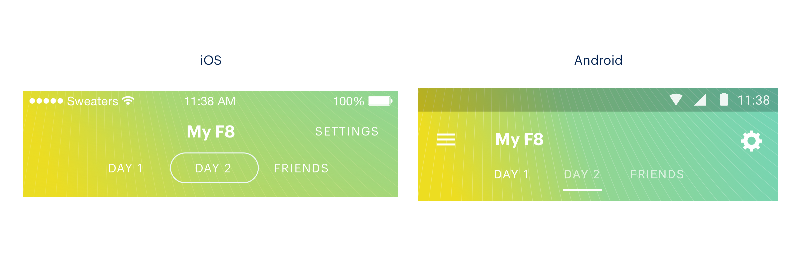
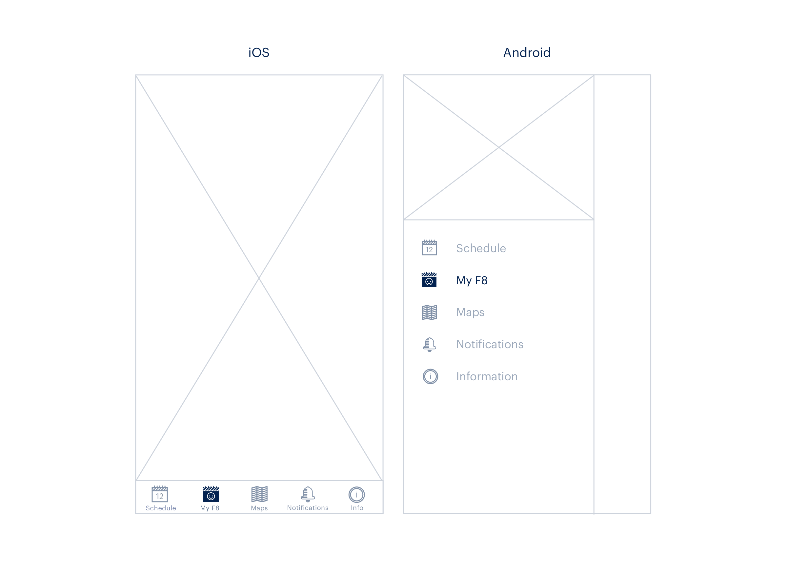

# 特定平台客製化

## 多平台設計

對應不同平台的 UI 佈局與樣式調整，也可以做到 JS 行為的不同
facebook F8 App 開發紀錄 - Designing an App for Multiple Platforms: [http://makeitopen.com/](http://makeitopen.com/)





##  方法一：特定平台的副檔名

- MyComponent.ios.js
- MyComponent.android.js

### 使用方法

```javascript
import MyComponent from './MyComponent';
```

## Platform 模組 （React Native 內建）

### 方法二：Platform.OS

- iOS
- android

```javascript
import { Platform, StyleSheet } from 'react-native';
const styles = StyleSheet.create({
  container: {
    height: Platform.OS === 'ios' ? 200 : 100
  }
});
```

### 方法三：Platform.select

```javascript
import { Platform, StyleSheet } from 'react-native';
const styles = StyleSheet.create({
  container: {
    flex: 1,
    ...Platform.select({
      ios: {
        backgroundColor: 'red'
      },
      android: {
        backgroundColor: 'blue'
      }
    })
  }
});
```
