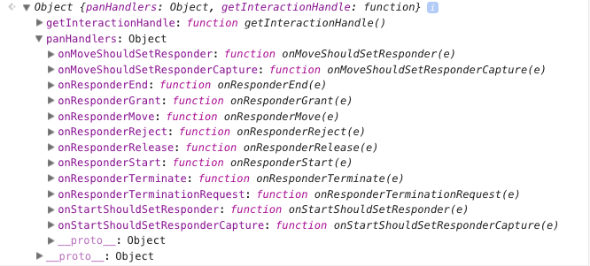

# 手勢追蹤 

透過 React Native 的 `PanResponder` API 來識別使用者的手勢操作

## 操作事件

PanResponder 提供以下的操作事件

- onMoveShouldSetPanResponder: (e, gestureState) => {...}
- onMoveShouldSetPanResponderCapture: (e, gestureState) => {...}
- onStartShouldSetPanResponder: (e, gestureState) => {...}
- onStartShouldSetPanResponderCapture: (e, gestureState) => {...}
- onPanResponderReject: (e, gestureState) => {...}
- onPanResponderGrant: (e, gestureState) => {...}
- onPanResponderStart: (e, gestureState) => {...}
- onPanResponderEnd: (e, gestureState) => {...}
- onPanResponderRelease: (e, gestureState) => {...}
- onPanResponderMove: (e, gestureState) => {...}
- onPanResponderTerminate: (e, gestureState) => {...}
- onPanResponderTerminationRequest: (e, gestureState) => {...}
- onShouldBlockNativeResponder: (e, gestureState) => {...}

在操作事件 callback 函數中可以拿到 nativeEvent 和 gestureState 兩個參數

### nativeEvent

- `changedTouches` - 在上一次事件之後，所有發生變化的觸摸事件的數組集合（即上一次事件後，所有移動過的觸摸點）
- `identifier` - 觸摸點的 ID
- `locationX` - 觸摸點相對於父元素的橫坐標
- `locationY` - 觸摸點相對於父元素的縱坐標
- `pageX` - 觸摸點相對於根元素的橫坐標
- `pageY` - 觸摸點相對於根元素的縱坐標
- `target` - 觸摸點所在的元素 ID
- `timestamp` - 觸摸事件的時間戳，可用於移動速度的計算
- `touches` - 當前屏幕上的所有觸摸點的集合

### gestureState

- `stateID` - 觸摸狀態的 ID。在屏幕上有至少一個觸摸點的情況下，這個 ID 會一直有效。
- `moveX` - 最近一次移動時的屏幕橫坐標
- `moveY` - 最近一次移動時的屏幕縱坐標
- `x0` - 當響應器產生時的屏幕坐標
- `y0` - 當響應器產生時的屏幕坐標
- `dx` - 從觸摸操作開始時的累計橫向路程
- `dy` - 從觸摸操作開始時的累計縱向路程
- `vx` - 當前的橫向移動速度
- `vy` - 當前的縱向移動速度
- `numberActiveTouches` - 當前在屏幕上的有效觸摸點的數量

## 使用方法

先用 API 產生 PanResponder

```js
panResponder = PanResponder.create({
  // events
  onPanResponderMove: (evt, gestureState) => {
    // do something
  }
});
```

產生的 panResponder

> 

再將產生出來的 panResponder.panHandlers 展開到要綁定事件的元件中

```xml
panResponder = PanResponder.create({
    // events
    onPanResponderMove: (evt, gestureState) => {
    }
});

...

render() {
    return (
        <View {...this.panResponder.panHandlers} />
    )
}
```
