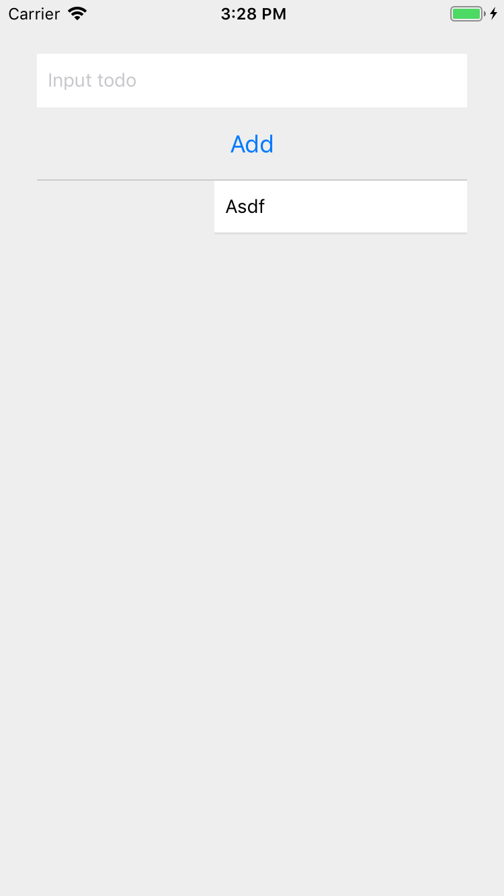

# ToDo List 手勢操作動畫練習

難度： 進階

目標： 在 ListItem 新增右滑功能，並且滑動超過一定值放開時刪除 ListItem

專案： [https://github.com/agileworks-tw/RN_Todo_Sample](https://github.com/agileworks-tw/RN_Todo_Sample)

練習：

1. 將 ListItem 改成獨立的 Component 檔案
2. 讓 ListItem 的 Container 支援動畫
3. 在 Container 綁定 `onPanResponderMove` 和 `onPanResponderRelease` 手勢事件
4. 在放開手勢時，若滑動距離超過 150 則播放從當前位置到最右側的動畫，若沒有則做動畫回到最左側
5. 加上刪除功能，若滑動距離超過 150，則播放完從當前位置到最右側的動畫後，將該 ListItem 刪除



## 練習前設置

### 下載專案

- ToDoList React Native Sample

```bash
cd ~/workspace
git clone https://github.com/kyoyadmoon/RN_Todo_Sample
cd RN_Todo_Sample
git checkout feature/add-todo-list
yarn
```

### 回復修改檔案狀態

```bash
git add .
git reset --hard HEAD
```

## 參考資料

### 練習解答

[https://github.com/agileworks-tw/RN_Todo_Sample/pull/13