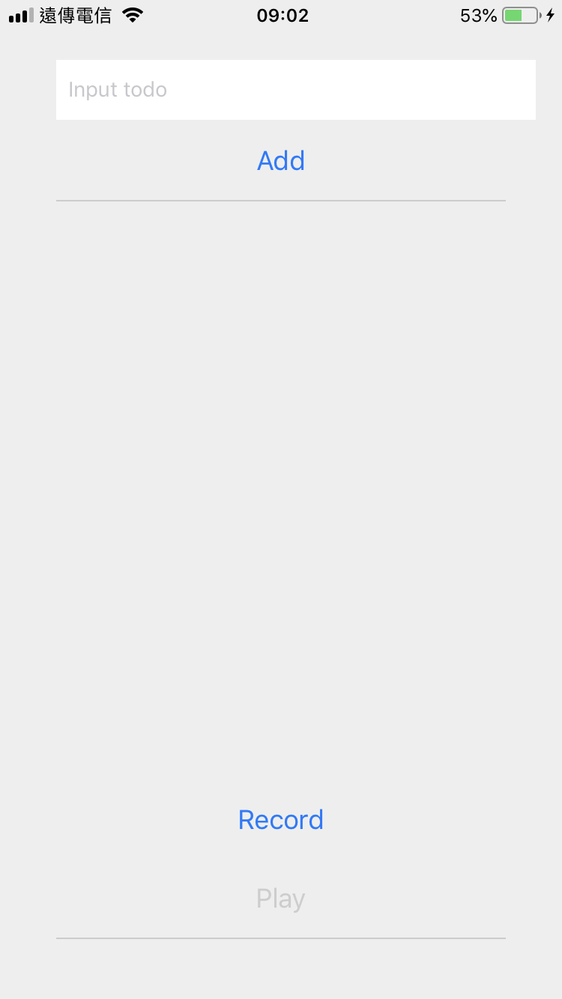
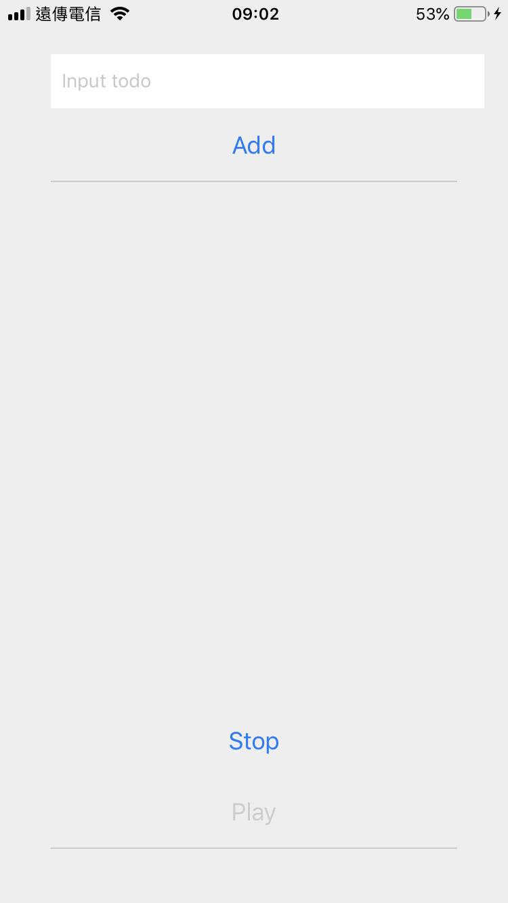
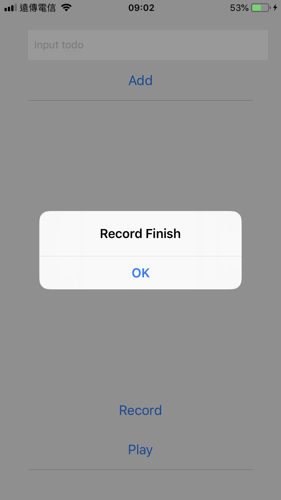

# ToDo List 音檔錄製播放練習

難度： 進階

目標： 新增聲音錄製功能，並且可播放錄製的音檔

專案： [https://github.com/agileworks-tw/RN_Todo_Sample](https://github.com/agileworks-tw/RN_Todo_Sample)

練習：

1. 安裝 `react-native-audio`, `react-native-sound`
2. 新增錄音、播放按鈕
3. 使用 `react-native-audio` 套件加上錄音功能
4. 使用 `react-native-sound` 加上播放錄音功能







## 練習前設置

### 下載專案

- ToDoList React Native Sample

```bash
cd ~/workspace
git clone https://github.com/kyoyadmoon/RN_Todo_Sample
cd RN_Todo_Sample
git checkout feature/add-todo-list
yarn
```

### 回復修改檔案狀態

```bash
git add .
git reset --hard HEAD
```

## 參考資料

### 套件使用範例

[https://github.com/jsierles/react-native-audio/blob/master/AudioExample/AudioExample.js](https://github.com/jsierles/react-native-audio/blob/master/AudioExample/AudioExample.js)

### 練習解答

[https://github.com/agileworks-tw/RN_Todo_Sample/pull/11](https://github.com/agileworks-tw/RN_Todo_Sample/pull/11)