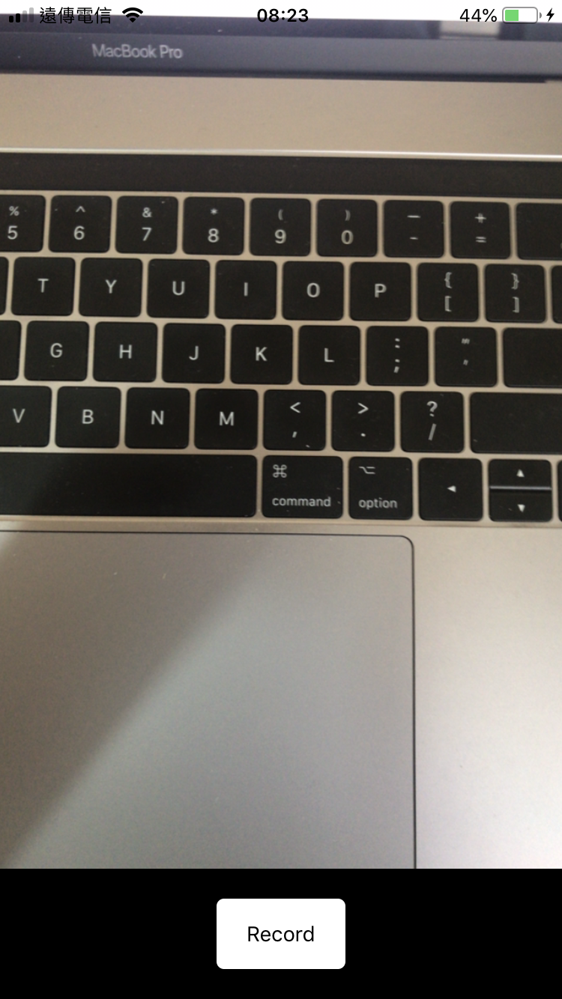
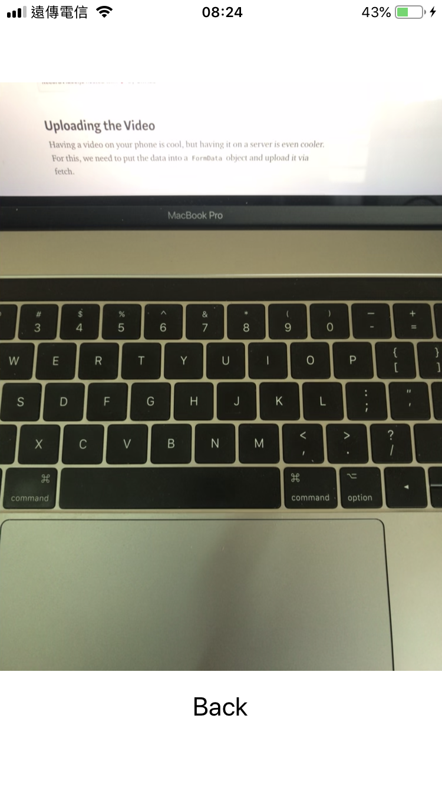

# 影片檔錄製播放練習

難度： 進階

目標： 新增錄影功能，並且可播放錄製的影片檔

專案： [https://github.com/agileworks-tw/RN_Todo_Sample](https://github.com/agileworks-tw/RN_Todo_Sample)

練習：

1. 安裝 `react-native-camera`, `react-native-video`
2. 新增一個錄影畫面
3. 使用 `react-native-camera` 套件加上錄影功能
4. 使用 `react-native-video` 加上播放錄影功能





## 練習前設置

### 下載專案

- ToDoList React Native Sample

```bash
cd ~/workspace
git clone https://github.com/kyoyadmoon/RN_Todo_Sample
cd RN_Todo_Sample
git checkout feature/async-storage
yarn
```

### 回復修改檔案狀態

```bash
git add .
git reset --hard HEAD
```

## 參考資料

### 練習解答

[https://github.com/agileworks-tw/RN_Todo_Sample/pull/12
