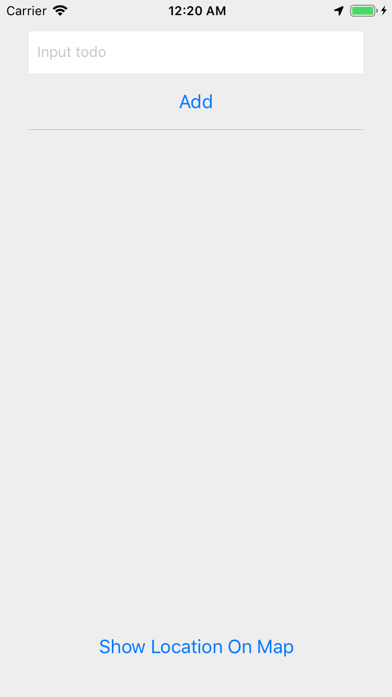
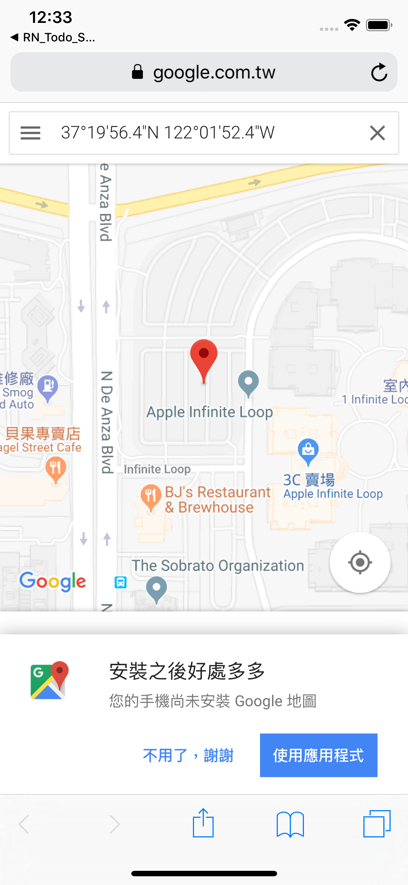

# 取得位置資訊練習

難度： 進階

目標： 設定原生專案取得位置資訊權限，並透過 Geolocation API 取得位置資訊

專案： [https://github.com/agileworks-tw/RN_Todo_Sample](https://github.com/agileworks-tw/RN_Todo_Sample)

練習：
將 ToDo List App 加上當前的位置座標資訊

1. 設定 App 原生專案的位置資訊權限
2. 在 App 載入時透過 Geolocation API 取得位置資訊
3. 新增一個顯示地圖按鈕，按下後開啟 Google 地圖連結，顯示當前位置



開啟後畫面



## 練習前設置

### 下載專案

- ToDoList React Native Sample

```bash
cd ~/workspace
git clone https://github.com/kyoyadmoon/RN_Todo_Sample
cd RN_Todo_Sample
git checkout feature/add-todo-list
yarn
```

### 執行專案 （依照順序執行)

Run React Native ToDoList

```bash
cd ~/workspace/RN_Todo_Sample
# 確認在 feature/add-todo-list branch
# 這會執行 packager server
react-native start
# 需要另外開一個 terminal
react-native run-android
# 模擬器連接 3000 port
adb reverse tcp:3000 tcp:3000
```

## 參考資料

Google 地圖座標網址

```js
import { Linking } from "react-native";
const url = `https://www.google.com.tw/maps?q=${latitude},${longitude}`;
Linking.openURL(url);
```

### 練習解答

[https://github.com/agileworks-tw/RN_Todo_Sample/pull/9](https://github.com/agileworks-tw/RN_Todo_Sample/pull/9)
