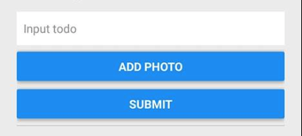

# ToDo List 取得相機相簿權限練習

難度： 進階

目標： 整合 Image Picker 套件，設定原生專案取得相機相簿權限，加入上傳相片功能

專案： [https://github.com/agileworks-tw/RN_Todo_Sample](https://github.com/agileworks-tw/RN_Todo_Sample)

練習：
將 ToDo List App 加上當前的位置座標資訊

1. 安裝 react-native-image-picker
2. 設定 App 原生專案的權限
3. 加入一個新增圖片的按鈕，並加上 onPress 事件調用 ImagePicker.showImagePicker

  

4. 將從選擇器挑選的圖片顯示在 ToDo List 頁面上

  
  
5. ToDo 項目加入圖片資料

  

## 練習前設置

### 下載專案

- ToDoList React Native Sample

```bash
cd ~/workspace
git clone https://github.com/kyoyadmoon/RN_Todo_Sample
cd RN_Todo_Sample
git checkout feature/geolocation
yarn
```

### 回復修改檔案狀態

```bash
git add .
git reset --hard HEAD
```

### 執行專案 （依照順序執行)

Run React Native ToDoList

```bash
cd ~/workspace/RN_Todo_Sample
# 確認在 feature/add-todo-list branch
# 這會執行 packager server
react-native start
# 需要另外開一個 terminal
react-native run-android
# 模擬器連接 3000 port
adb reverse tcp:3000 tcp:3000
```

## 參考資料

### 練習解答

[https://github.com/agileworks-tw/RN_Todo_Sample/pull/10](https://github.com/agileworks-tw/RN_Todo_Sample/pull/10)
