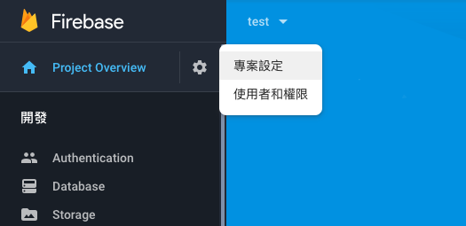
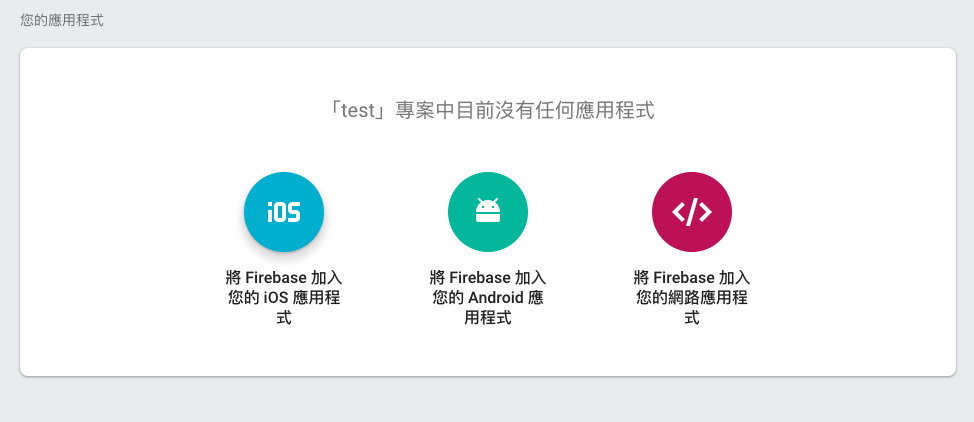
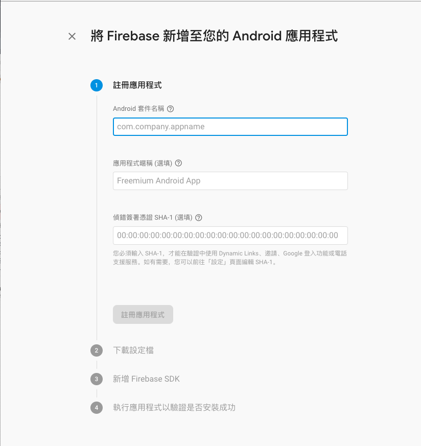
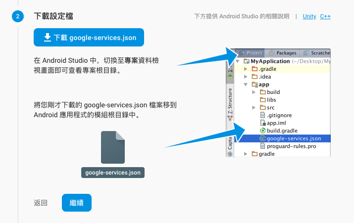
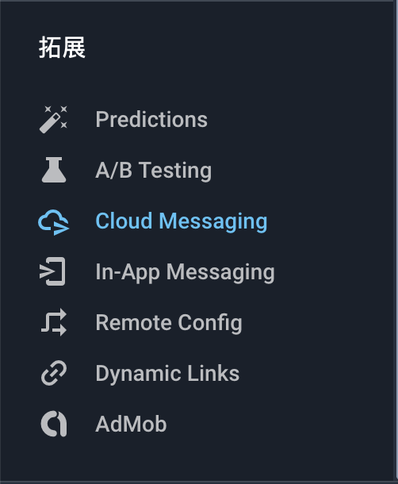
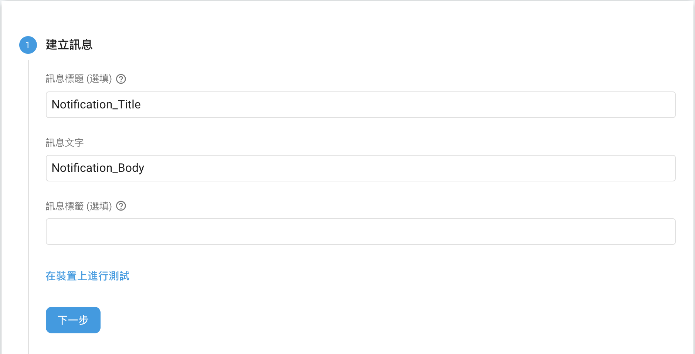

# Firebase 套件設定

## 帳號申請

`Firebase ` : [https://firebase.google.com/](https://firebase.google.com/)

Firebase 是 Google 的服務，可以直接使用原有 Google 帳號登入，或是新建一個 Google 帳號

## 新建專案

控制台: [https://console.firebase.google.com/](https://console.firebase.google.com/)

點選新建專案按鈕，輸入專案名稱 (預設為 Spark 免費方案)

## 新增應用程式

Firebase 的專案可以有多個應用程式，你可以在這裡新增該專案的 iOS 和 Android 應用程式

1. 左上角的齒輪按鈕點選後，進入專案設定頁面
   

2. 選擇要新增的應用程式
   

3. 註冊應用程式資訊

   填入套件名稱，你可以在 `android/app/build.gradle` 找到 `applicationId` 

   

4. 下載設定檔
    設定檔在下個章節會需要用到，也可以回到控制台的專案設定頁面重新下載

    

5. 這一頁剩下的步驟請直接按`繼續`和`略過此步驟`跳過

## 發送推播通知

從 Firebase 後台可以發出推播通知到應用程式

