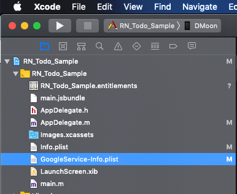

## 套件

`react-native-firebase` 

GitHub: [https://github.com/invertase/react-native-firebase](https://github.com/invertase/react-native-firebase)

文件: [https://rnfirebase.io/docs](https://rnfirebase.io/docs)

## 安裝

```bash
npm install --save react-native-firebase
```

## 整合

### Basic

1. 下載 Firebase 專案 iOS 應用程式的 `GoogleService-Info.plist`，並將檔案放到 `ios/[YOUR APP NAME]/GoogleService-Info.plist`

2. 開啟 Xcode ，將 `GoogleService-Info.plist` 檔案從 finder 拖曳到專案中
  

3. 編輯 `ios/[YOUR APP NAME]/AppDelegate.m` 
  最上方加入

  ```
  #import <Firebase.h>
  ```

  找到 `didFinishLaunchingWithOptions:(NSDictionary *)launchOptions ` method

  在 method 中開頭處加入

  ```
  [FIRApp configure];
  ```

4. 安裝 CocoaPods (已經安裝可以略過)

  ```bash
  sudo gem install cocoapods
  ```

5. 初始化 Podfile

  ```bash
  cd ios && pod init
  ```

6. 修改 `Podfile`

  1. ##### 取消這行註解

  ```
  platform :ios, '9.0'
  ```

  2. ##### 加入這行

  ```podfile
  # Required by RNFirebase
  pod 'Firebase/Core', '~> 5.11.0'
  ```

7. link

  ```bash
  react-native link react-native-firebase
  ```


### Messaging Module

參考: [https://rnfirebase.io/docs/v5.x.x/messaging/ios](https://rnfirebase.io/docs/v5.x.x/messaging/ios)

### Notification Module

參考: [https://rnfirebase.io/docs/v5.x.x/notifications/ios](https://rnfirebase.io/docs/v5.x.x/notifications/ios)