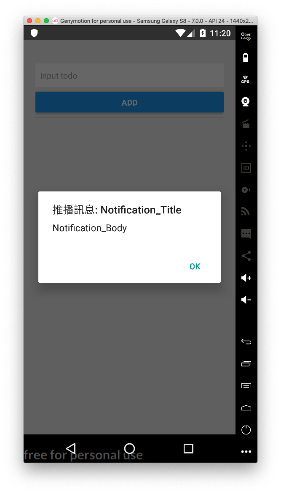

# 接收推播練習

難度： 進階

目標： 整合 Firebase SDK，接收推播通知

專案： [https://github.com/agileworks-tw/RN_Todo_Sample](https://github.com/agileworks-tw/RN_Todo_Sample)

練習：

1. 安裝 react-native-firebase
2. 整合 Firebase
3. 監聽接收推播訊息



## 練習前設置

### 下載專案

- ToDoList React Native Sample

```bash
cd ~/workspace
git clone https://github.com/kyoyadmoon/RN_Todo_Sample
cd RN_Todo_Sample
git checkout add-todo-list
yarn
```

### 執行專案 （依照順序執行)

Run React Native ToDoList

```bash
cd ~/workspace/RN_Todo_Sample
# 確認在 feature/add-todo-list branch
# 這會執行 packager server
react-native start
# 需要另外開一個 terminal
react-native run-android
# 模擬器連接 3000 port
adb reverse tcp:3000 tcp:3000
```

## 參考資料

### 練習解答

https://github.com/agileworks-tw/RN_Todo_Sample/pull/10